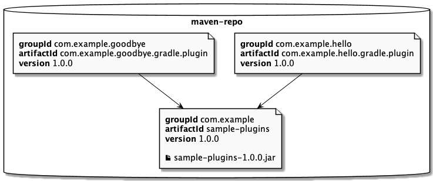
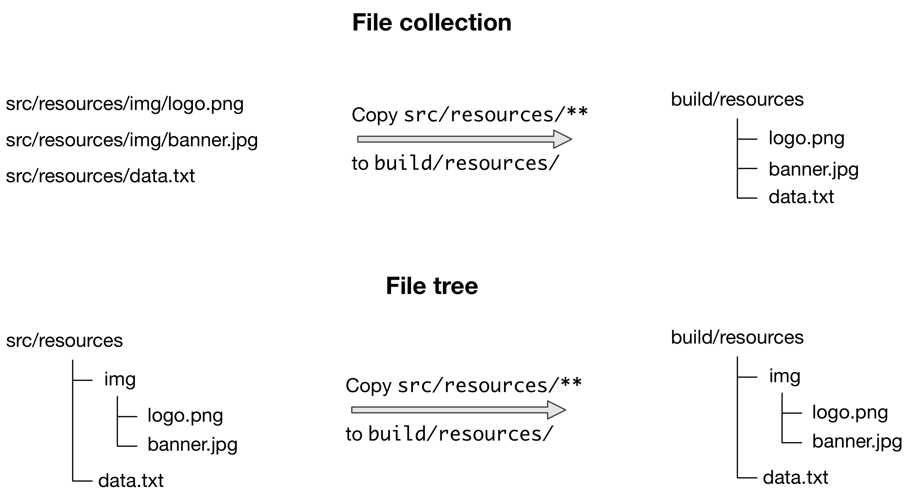
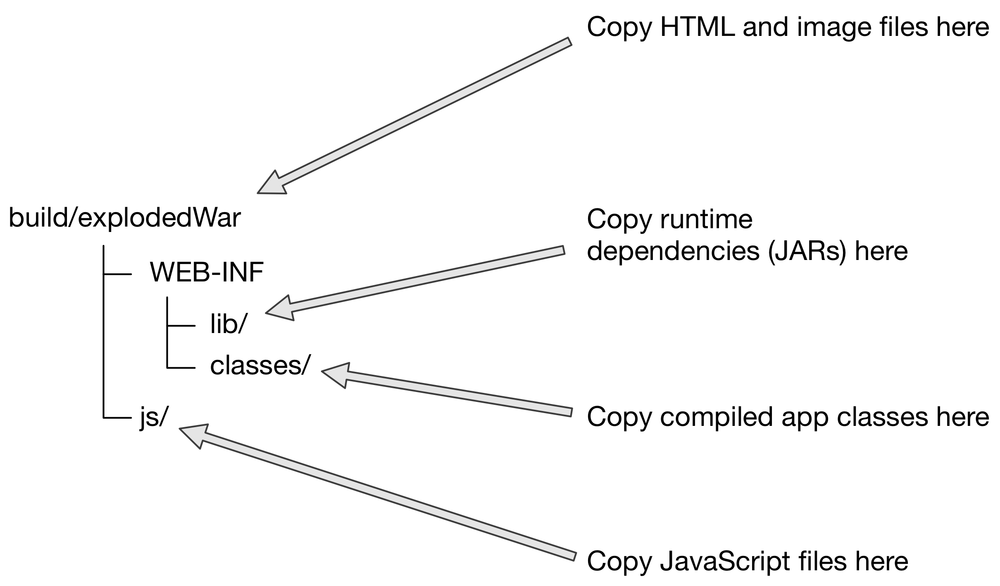

## Gradle 命令

```shell
> gradle [taskName...] -q -PbuildProfile=xx
> gradle :projectA:taskName  -q -PbuildProfile=xx
> gradle [taskName...] -q -PbuildProfile=xx --init-script=init-file.gradle

# 好用的内置task
> gradle properties
> gradle projects
> gradle tasks
> gradle -q javaToolchains 
```

> -q 设置日志级别为，quiet 也就是最高的日志级别 ，println 输出的信息就是输入 quiet级别的日志
>
> `-s` 显示错误的堆栈信息
>
> `-P` 指定Project参数
>
> --init-script 指定初始化脚本，简写是 `-I`
>
> `:` 表示根目录
>
> --status 查看 Gradle 守护进行
>
> --stop 停止守护进程
>
> --continuous 或者 -t 参数，持续构建
>
> **`gradle -q help --task processUrl`** help --task 可以为任务声明的所有选项呈现为控制台输出。
>
> --param=xx 给命令行参数param设置值（配合 @Option 使用）
>
> `-b` 指定构建文件
>
> gradle -q dependencies --configuration testRuntimeClasspath 查看依赖项


常用的插件

```groovy
// 新语法，只能卸载构建文件或者配置文件的第一行
plugin{
	id 'application'
}

// 老语法
apply plugin:'application'

/*
	application 执行java应用程序，调用main方法
*/
```

## 资料

**注意**：Gradle 是运行在JVM上的，所以要使用Gradle 必须安装JRE 或者 JDK

安装教程：https://gradle.org/install/

官网使用文档：https://docs.gradle.org/current/userguide/what_is_gradle.html

中文社区：https://doc.codingdict.com/gradle-user-guide/introduction/

自定义插件教程：https://kt-learn.cn/2021/06/03/Android-gradle-customPlugin/

插件相关：https://www.jianshu.com/p/8f9532e0bd54

Gradle 配置国内源：https://www.jianshu.com/p/319e7a8faa6a

快速入门可以看example：https://docs.gradle.org/current/samples/index.html#java_modules

## Gradle 的知识

- Gradle优点：构建速度比Maven快2-10 倍，支持增量构建(只编译改动的地方，而且准确性很高)
- 每个 Gradle 构建项目是由一个或多个Project组成，每个Project中包含多个Task，可以自定义Task，也可以直接导入Plugin ，使用Plugin中定义好的Task
- gradle 构建任务执行的是Project中的Task，是以Task 为维度进行构建的

## 01-gradle-build-lifecycle

官网：https://docs.gradle.org/current/userguide/build_lifecycle.html

- Gradle build 生命周期（初始化 配置 执行）
- 监听配置：
    - evaluation：监听具有特定属性的project 或者 监听所有project
    - addTaskListener
    - taskExecutionListener

## Gradle 管理的目录

官网: https://docs.gradle.org/current/userguide/directory_layout.html

- 用户根目录：默认值$USER_HOME/.gradle/
- 项目根目录

**Gradle 会自动清理缓存目录**

## 02-build-script

官网：https://docs.gradle.org/current/userguide/tutorial_using_tasks.html

- 简单task 的注册、编写
- task 依赖，task 依赖 支持 lazy(支持先使用后定义)
- 灵活的任务注册：可以在循环中注册task
- 通过 API 访问任务 添加依赖项,通过 API 访问任务 添加行为
- 使用 Ant 任务：如何执行 Ant 任务以及如何访问 Ant 属性
- 使用方法
- 定义默认任务：命令执行的时候未指定task，那么就会执行默认任务
- 构建脚本的外部依赖：通过 builscript，添加依赖到classpath 中，这样子就可以直接使用依赖里面的所有类了

> 调用 `doFirst` 和 `doLast` 可以多次执行。它们将操作添加到任务操作列表的开头或结尾。执行任务时，将按顺序执行操作列表中的操作。

#### 延伸阅读

本章只是触及了可能性的表面。以下是一些可能有趣的其他主题：

- [创作可维护的生成脚本](https://docs.gradle.org/current/userguide/authoring_maintainable_build_scripts.html#authoring_maintainable_build_scripts)
- [整理您的 Gradle 项目](https://docs.gradle.org/current/userguide/organizing_gradle_projects.html#organizing_gradle_projects)
- [编写自定义任务](https://docs.gradle.org/current/userguide/custom_tasks.html#custom_tasks)

## 03-more-build-script-info

官网：https://docs.gradle.org/current/userguide/writing_build_scripts.html

- 每个 构建脚本中都有一个内置对象 Project，我们可以隐式或者显示的调用Project 提供的API

- 声明变量：

    - def 隐式声明变量
    - type 指定类型声明变量

  ```groovy
  def xx = "hello world"
  String msg = "xxx"
  ```

- 额外属性：每个领域对象都包含额外属性，包括但不限于projects, tasks, and source sets。可以通过所属对象的 `ext` 属性添加、读取和设置额外的属性。或者，`ext` 块一次添加多个属性。

- 配置对象：可以在脚本中定义属性 也可以读取外部脚本定义的属性

> 标准项目属性

| 名字            | 类型                                                         | 默认值                                    |
|:--------------| :----------------------------------------------------------- |:---------------------------------------|
| `project`     | [Project](https://docs.gradle.org/current/dsl/org.gradle.api.Project.html) | `Project`实例                            |
| `name`        | `String`                                                     | 项目目录的名称。                               |
| `path`        | `String`                                                     | 项目的绝对路径。                               |
| `description` | `String`                                                     | 项目的说明。                                 |
| `rootDir`     | `File`                                                       | 根项目的目录。如果是单模块项目，那么rootDir = projectDir |
| `projectDir`  | `File`                                                       | 包含生成脚本的目录。                             |
| `buildDir`    | `File`                                                       | `*projectDir*/build`                   |
| `group`       | `Object`                                                     | `unspecified`                          |
| `version`     | `Object`                                                     | `unspecified`                          |
| `ant`         | [AntBuilder](https://docs.gradle.org/current/javadoc/org/gradle/api/AntBuilder.html) | `AntBuilder` 实例                        |

## 04-groovy-basic

Groovy 基础：

- each 遍历集合元素

- 属性的获取和设置：可以省略 get 和 set

- 方法的调用：可以省略()

- List 和 Map 的定义
    - test.includes = ['org/gradle/api/**', 'org/gradle/internal/**']
    - List<String> list = new ArrayList<String>()
    - Map<String, String> map = [key1:'value1', key2: 'value2']
    - 注意 `apply plugin: 'java'` 这个是 Gradle 提供的特殊写法（Groovy 将强制命名参数到单个 map 参数中）

- 在 Gradle 闭包作为方法的最后一个参数：当方法的最后一个参数是闭包时，可以将闭包放在方法调用之后

  ```groovy
  repositories {
      println "in a closure"
      println delegate
  }
  repositories() { println "in a closure" }
  repositories({ println "in a closure" })
  ```

- 每个闭包都有一个delegate对象，Groovy 用它来查找变量和方法引用，这些变量和方法引用不是闭包的局部变量或参数。

> 闭包相关知识可以看这篇文章：https://www.cnblogs.com/zqlxtt/articles/5741297.html

闭包的知识点：

- 如何定义闭包
  ```groovy
  { [closureParameters -> ] statements }
  ```

- 如果调用闭包
  ```groovy
  // 闭包名+（）或者闭包名.call()来调用闭包。
  def code = { 123 }
  assert code() == 123
  assert code.call() == 123
  ```

- 闭包中的隐式参数
    ```groovy
    // 当闭包没有显式声明参数时，其默认包含一个隐式的参数it。
    def greeting = { "Hello, $it!" }
    assert greeting('Patrick') == 'Hello, Patrick!'
    ```

- 委托策略
    - 委托策略是groovy中闭包独有的语法，这也使得闭包较java的lambda更为高级。委托策略就是指定 内置对象的取值
    - 当一个属性没有指明其所有者的时候，就需要根据委托策略，决定这个属性以何种顺序找到该属性的值

    - 首先了解一下 比包中的内置对象：Owner，delegate和this
        - this 表示定义闭包的外围类。
            - this表示的具体是哪个对象可以从this往外找，遇到的第一类就是this代表的类。
        - owner 表示定义闭包的直接外围对象，可以是类或者闭包。
            - owner与this类似，只不过owner表示的是直接外围对象，可以是类也可以是闭包
        - delegate 表示一个用于处理方法调用和属性处理的第三方类。
            - delegate 它默认与owner一致，但可以由用户自定义其代表的对象。

      ```groovy
      // 闭包中，使用this关键字或者调用方法getThisObject()来获得其外围类：
      def whatIsThisObject = { getThisObject() }  
      def whatIsThis = { this }     
      
      def whatIsOwnerMethod = { getOwner() }                               
      def whatIsOwner = { owner } 
      
      def cl = { getDelegate() }                          
      def cl2 = { delegate }       
      ```


- 委托策略的设置和可选值

    - `closureObj.resolveStrategy = Closure.DELEGATE_FIRST`
    - Closure.OWNER_FIRST 这是默认的策略，优先从owner中寻找属性或方法，找不到再从delegete中寻找。上面的例子就是因为在owner中没有找到name，接着在delegate中找到了name属性。
    - Closure.DELEGATE_FIRST 与OWNER_FIRST相反。
    - Closure.OWNER_ONLY 只在owner中寻找。
    - Closure.DELEGATE_ONLY 只在delegate中寻找。
    - Closure.TO_SELF 在闭包自身中寻找。

  ```groovy
  class Person {
    String name
    def pretty = { "My name is $name" }             
    String toString() {
        pretty()
    }
  }
  class Thing {
      String name                                     
  }
  def p = new Person(name: 'Sarah')
  def t = new Thing(name: 'Teapot')
  
  assert p.toString() == 'My name is Sarah'           
  p.pretty.delegate = t                                                
  assert p.toString() == 'My name is Sarah' 
  pretty.resolveStrategy = Closure.DELEGATE_FIRST
  ```

## 05-using-gradle-plugin

什么是插件：插件就是实现插件接口的任何类

插件好处：增强Gradle ，封装Task 进重用并减少跨多个项目维护类似逻辑的开销

插件的类型：脚本插件 和 二进制插件

使用插件：要使用封装在插件中的构建逻辑，Gradle 需要执行两个步骤。首先，它需要***解析*插件**，然后它需要将插件***应用于*目标**，通常是一个项目.

如何应用插件：`Plugin.apply（T）` 或者是 `apply plugin:java` 。应用插件是*幂等的*。也就是说，您可以安全地多次应用任何插件而不会产生副作用

Gradle 核心插件 可以使用短名称导入 如`java`,非核心插件需要通过全类名导入 如`cn.haitaoss.Demo`

### 使用插件DSL 应用插件

```groovy
plugins {
    // 对于核心 Gradle 插件或已可用于构建脚本的插件
    id « plugin id »

    // 对于需要解析的二进制 Gradle 插件
    id « plugin id » version « plugin version » [apply « false »]
}
/* 
	其中 `«plugin id»` 和 `«plugin version»` 必须是常量，文字、字符串和带有`boolean`的 `apply` 语句可用于禁用立即应用插件的默认行为（例如，您只想在`subprojects`应用它）。不允许使用其他声明;它们的存在将导致编译错误。
*/
```

局限性：

- **==`plugins {}` 块也必须是构建脚本中的顶级语句==**。它不能嵌套在另一个构造（例如 if 语句或 for 循环）中。
- `plugins {}` 块目前只能在**项目的构建脚本**和 **settings.gradle** 文件中使用。它不能在脚本插件或初始化脚本中使用。（未来版本将会删除）
- `apply plugin: java` 用法很灵活，但是这个过时的语法

如果`plugins {}`
块的限制令人望而却步，则建议的方法是使用 [buildscript {} 块](https://docs.gradle.org/current/userguide/plugins.html#sec:applying_plugins_buildscript)应用插件
.

#### 从 *buildSrc* 目录中应用插件

就是我们可以在buildSrc 目录下，编写 build.gradle 文件，在文件里面注册插件，后需要就是使用注册插件时的id 来引用到注册的插件

```groovy
plugins {
    id 'java-gradle-plugin'
}

// 绑定插件实现类 — `my.MyPlugin`
gradlePlugin {
    plugins {
        myPlugins {
            id = 'my-plugin'
            implementationClass = 'my.MyPlugin'
        }
    }
}
```

### 插件的管理

`pluginManagement {}` 块只能出现在 `settings.gradle` 文件中（它必须是文件中的第一个块）或初始化脚本中.

### 自定义插件存储库

默认情况下，`plugins {}` DSL 解析来自公共 Gradle 插件门户的插件。许多构建作者还希望解析私有 Maven 或 Ivy 存储库中的插件，因为这些插件包含专有的实现细节，或者只是为了更好地控制哪些插件可用于其构建。
要指定自定义插件存储库，请使用 `pluginManagement {}``repositories {}` 块:

```groovy
pluginManagement {
    repositories {
      // 插件查找顺序 maven -> gradlePluginPortal -> ivy
        maven {
            url './maven-repo'
        }
        gradlePluginPortal()
        ivy {
            url './ivy-repo'
        }
    }
}
```

### 插件版本管理

```groovy
pluginManagement {
  // 插件版本管理
  plugins {
    // helloPluginVersion 可以配置在 gradle.properties 文件中
    id 'com.example.hello' version "${helloPluginVersion}"
  }
}
```

插件版本从 `gradle.properties` 加载并在设置脚本中进行配置，允许将插件添加到任何项目中，而无需指定版本。

```groovy
plugins {
    id 'com.example.hello'
}
```

### 插件解析规则

插件解析规则允许您修改在`plugins {}` 块中发出的插件请求，例如更改请求的版本或显式指定实现工件坐标。 要添加解析规则，请使用插件管理 `resolutionStrategy {}` `pluginManagement {}`：

```groovy
pluginManagement {
    resolutionStrategy {
        eachPlugin {
            // 这告诉 Gradle 使用指定的插件实现 artifact ，而不是使用从插件 ID 到 Maven/Ivy 坐标的内置默认映射。
            if (requested.id.namespace == 'com.example') {
                useModule('com.example:sample-plugins:1.0.0')
            }
        }
    }
    repositories {
        maven {
            url './maven-repo'
        }
        gradlePluginPortal()
        ivy {
            url './ivy-repo'
        }
    }
}
```

### 插件 Marker Artifacts

就是将插件打包成jar，存到仓库里面

```groovy
plugins {
    id 'java-gradle-plugin'
    id 'maven-publish'
    id 'ivy-publish'
}

group 'com.example'
version '1.0.0'

gradlePlugin {
    plugins {
        hello {
            id = 'com.example.hello'
            implementationClass = 'com.example.hello.HelloPlugin'
        }
        goodbye {
            id = 'com.example.goodbye'
            implementationClass = 'com.example.goodbye.GoodbyePlugin'
        }
    }
}

publishing {
    repositories {
        maven {
            url '../../consuming/maven-repo'
        }
    }
}
```

在示例目录中运行 `gradle publish` 会创建以下 Maven 存储库布局



### 旧版插件应用程序

随着[插件DSL](https://docs.gradle.org/current/userguide/plugins.html#sec:plugins_block)的引入，用户应该没有理由使用应用插件的遗留方法。此处记录了它，以防构建作者由于当前工作方式的限制而无法使用插件DSL。

#### 应用二进制插件

示例 11.应用二进制插件

build.gradle

```
apply plugin: 'java'
```

可以使用插件 *ID 应用插件*。在上述情况下，我们使用短名称"`java`"
来应用[JavaPlugin。](https://docs.gradle.org/current/javadoc/org/gradle/api/plugins/JavaPlugin.html).

除了使用插件ID之外，还可以通过简单地指定插件的类来应用插件：

示例 12.按类型应用二进制插件

build.gradle

```
apply plugin: JavaPlugin
```

上面示例中的 `JavaPlugin`
符号指的是 [JavaPlugin](https://docs.gradle.org/current/javadoc/org/gradle/api/plugins/JavaPlugin.html)。此类并不严格需要导入，因为 `org.gradle.api.plugins`
包会自动导入到所有构建脚本中（请参阅[默认导入](https://docs.gradle.org/current/userguide/writing_build_scripts.html#script-default-imports)).

此外，没有必要附加`.class`来识别Groovy中的类文本，就像在Java中一样。

#### 使用构建脚本块应用插件

已发布为外部 jar 文件的二进制插件可以通过将插件添加到构建脚本类路径，然后应用插件来添加到项目中。可以使用构建`buildscript {}` 块将外部 jar
添加到构建脚本类路径中，如[构建脚本的外部依赖项](https://docs.gradle.org/current/userguide/tutorial_using_tasks.html#sec:build_script_external_dependencies)中所述
.

示例 13.使用构建脚本块应用插件

build.gradle

```
buildscript {
    repositories {
        gradlePluginPortal()
    }
    dependencies {
        classpath 'com.jfrog.bintray.gradle:gradle-bintray-plugin:1.8.5'
    }
}

apply plugin: 'com.jfrog.bintray'
```

### 脚本插件

```
apply from: 'other.gradle'
```

脚本插件会自动解析，并且可以从本地文件系统上的脚本或远程位置应用。文件系统位置相对于项目目录，而远程脚本位置是使用 HTTP URL 指定的。可以将多个脚本插件（任何一种形式）应用于给定目标。

### 查找社区插件

Gradle拥有一个充满活力的插件开发人员社区，他们为各种功能贡献插件。Gradle [插件门户](https://plugins.gradle.org/)提供了一个用于搜索和探索社区插件的界面。

## 06-working-with-file

官网：https://docs.gradle.org/current/userguide/working_with_files.html

```shell
# 执行properties 任务，查看构建脚本中的参数值是多少
gradle -q properties | grep 'Dir.*' 
```

### 简单文件操作

- 复制单个文件
- 复制多个文件
- 复制文件时设置：平面过滤器，深度过滤器
- 复制目录结构
- 创建存档（zip、tar等）
- 解压
- Creating "uber" or "fat" JARs (就是打包的jar文件中包含依赖的jar)
- 创建目录
- 移动文件和目录
- 复制时重命名文件
- 删除文件、删除目录

### 文件路径的深入学习：

- 通过脚本属性得到文件目录绝对路径：
    - layout.buildDirectory，layout.projectDirectory
    - "${buildDir}"  "${projectDir}"  "${rootDir}"
    - 在多项目构建中 rootDir 指定的父模块的路径。当单项目构建中 projectDir == rootDir
- `file()` 方法与不同类型的参数
- 文件集合：就是把多个文件对象组成集合
    - 文件集合重要的属性：懒惰地创建，迭代，过滤，组合
- 文件树：文件树是一个文件集合，它保留它所包含的文件的目录结构
    - 如何创建文件数
    - 文件树有默认排除规则，可以看官网，如果排除规则不需要可以在 settings.gradle 中移除
    - 文件树支持的操作：遍历、过滤、合并
- 使用归档文件作为文件树
- 了解到文件集合的隐式转换

> 尽管 `FileTree` 扩展了 `FileCollection`（一种 is-a 关系），但它们的行为确实不同。换句话说，您可以在任何需要文件集合的地方使用文件树，但请记住：文件集合是文件的平面列表/文件集，而文件树是文件和目录层次结构。若要将文件树转换为平面集合，请使用 [FileTree.getFiles（）](https://docs.gradle.org/current/javadoc/org/gradle/api/file/FileTree.html#getFiles--) 属性。



### 文件复制的深入学习

- 复制文件
- 复制时进行过滤
- 复制时重命名文件
- 复制时 筛选文件内容（令牌替换、模板化等）
- 使用 CopySpec 类
    - 定义共享复制规范（就是定义一份复制规范（复制源、过滤、重命名等））
    - 嵌套复制规范
- 在您自己的任务中复制文件
- 使用`Sync`任务镜像目录和文件集合 (如果复制的目录排除了一些文件，那么源目录也会删除 保证复制目录和源目录一样)
- 将单个文件部署到应用程序服务器

对于这种复制需求，我们应该通过子规范来实现



### 深入创建归档文件

- 将目录压缩
- 归档文件命名：默认值；自定义
- 在多个存档之间共享内容：就是共享归档文件规范
- 设置可重现的存档：需求 有时，最好在不同的计算机上以完全相同的字节为单位重新创建存档

您可以在 [AbstractArchiveTask](https://docs.gradle.org/current/dsl/org.gradle.api.tasks.bundling.AbstractArchiveTask.html) 的
API 文档中找到所有可能的存档任务属性，但我们也在这里总结了主要的属性：

- `archiveFileName` — `Property<String>`
  ，默认：`*archiveBaseName*-*archiveAppendix*-*archiveVersion*-*archiveClassifier*.*archiveExtension*`

  生成的存档的完整文件名。如果默认值中的任何属性为空，则删除其"-"分隔符。

- `archiveFile` — `Provider<RegularFile>`，*只读*，默认值：`*destinationDirectory*/*archiveFileName*`

  生成的存档的绝对文件路径。

- `destinationDirectory` — `DirectoryProperty`，缺省值：取决于存档类型

  要在其中放置生成的存档的目标目录。默认情况下，JAR 和 WAR 进入`$buildDir/libs`。ZIP 和 TAR 进入`$buildDir/distributions`.

- `archiveBaseName` — `Property<String>`，默认值：`*project.name*`

  存档文件名的基本名称部分，通常是项目名称或它所包含内容的其他一些描述性名称。

- `archiveAppendix` — `Property<String>`，默认值：`null`

  紧跟在基本名称之后的存档文件名的附录部分。它通常用于区分不同形式的内容，例如代码和文档，或最小分发版与完整或完整分发版。

- `archiveVersion` — `Property<String>`，默认值：`*project.version*`

  归档文件名称的版本部分，通常采用普通项目或产品版本的形式。

- `archiveClassifier` — `Property<String>`，默认值：`null`

  存档文件名的分类器部分。通常用于区分面向不同平台的存档。

- `archiveExtension` — `Property<String>`，默认值：取决于归档类型和压缩类型

  存档的文件扩展名。默认情况下，这是根据存档任务类型和压缩类型（如果要创建 TAR）设置的。将是其中之一：`zip`，`jar`，`war`，`tar`，`tgz`或`tbz2`。如果您愿意，您当然可以将其设置为自定义扩展。

## 07-using-log

官网：https://docs.gradle.org/current/userguide/logging.html

- Gradle 日志级别
    - DEBUG、INFO、LIFECYCLE、WARN、QUIET、ERROR
- Gradle 如何选择日志级别
    - gradle.propertie
    - 命令行参数
- Gradle 默认日志级别
    - LIFECYCLE
- Gradle 如何输出日志
    - println
    - logger
    - SLF4J
- Gradle 配置日志管理器
    - 配置标准输出捕获
    - 任务配置标准输出捕获
- 指定 Gradle 日记显示模板

## 08-multiply-project-build

官网：https://docs.gradle.org/current/userguide/multi_project_builds.html

Gradle 中的多项目构建由一个根项目和一个或多个子项目组成。

- 使用 application 插件，执行java程序的main方法
- 项目依赖
- 制作自己的插件

## 09 09-develop-gradle-task

官网：https://docs.gradle.org/current/userguide/more_about_tasks.html

- 任务输出
    - `(no label)`或`EXECUTED`

      任务执行了其操作。任务具有操作，Gradle
      已确定应将其作为构建的一部分执行。任务没有操作和一些依赖项，并且执行任何依赖项。另请参阅[生命周期任务](https://docs.gradle.org/current/userguide/more_about_tasks.html#sec:lifecycle_tasks)
      .

    - `UP-TO-DATE`

      任务的输出未更改。任务具有输出和输入，但它们没有更改。请参阅[增量构建](https://docs.gradle.org/current/userguide/more_about_tasks.html#sec:up_to_date_checks).任务有操作，但任务告诉
      Gradle
      它没有更改其输出。任务没有操作和一些依赖项，但所有依赖项都是最新的、跳过的或从缓存中跳过的。另请参阅[生命周期任务](https://docs.gradle.org/current/userguide/more_about_tasks.html#sec:lifecycle_tasks).任务没有操作，也没有依赖项。

    - `FROM-CACHE`

      可以从以前的执行中找到任务的输出。任务具有从生成缓存还原的输出。请参阅[构建缓存](https://docs.gradle.org/current/userguide/build_cache.html#build_cache).

    - `SKIPPED`

      任务未执行其操作。任务已从命令行中显式排除。请参阅[从执行中排除任务](https://docs.gradle.org/current/userguide/command_line_interface.html#sec:excluding_tasks_from_the_command_line).任务仅`onlyIf`谓词返回
      false。请参阅[使用谓词](https://docs.gradle.org/current/userguide/more_about_tasks.html#sec:using_a_predicate).

    - `NO-SOURCE`

      任务不需要执行其操作。任务有输入和输出，[但没有源](https://docs.gradle.org/current/userguide/more_about_tasks.html#skip-when-empty)。例如，源文件是 [javacompile](https://docs.gradle.org/current/dsl/org.gradle.api.tasks.compile.JavaCompile.html) `.java`
      文件.
- 定义任务
- 定位任务（可以理解成从集合中获取任务，获取的参数是什么）
    - tasks.named('name')
    - tasks.withType(Class)
    - tasks.getByPath('hello').path 不建议使用
- 配置任务
    - 定义一个没有默认行为的任务
    - 定义任务之后，在配置任务
    - 使用配置块定义任务
- 将参数传递给任务构造器
- 添加依赖到任务中
    - 另一个项目添加对任务的依赖关系
    - 使用任务 Provider 对象添加依赖关系
- 任务排序
    - 有两种可用的排序规则："*必须在之后运行*"和"*应该在之后运行*"。
    - 请注意，"`B.mustRunAfter(A)`"或"`B.shouldRunAfter(A)`"并不意味着任务之间存在任何执行依赖关系：
        - 可以独立执行任务 `A` 和 `B`。仅当计划执行这两个任务时，排序规则才有效。
        - 当使用 `--continue` 运行时，`B` 可以在 `A` 失败时执行。
- 向任务添加描述
- 跳过任务
    - 使用谓词跳过任务
    - 使用 StopExecutionException 跳过任务
    - 启用和禁用任务
    - 任务超时
- 任务规则
- 终结器任务
- 生命周期任务
    - 生命周期任务是本身不工作的任务。它们通常没有任何任务操作。生命周期任务可以表示几个概念：
        - 工作流步骤（例如，运行所有检查和check)
        - 可构建的东西
        - 一个方便的任务来执行许多相同的逻辑任务（例如，使用 compileAll 运行所有编译任务)
        - 基本插件定义了几个标准的生命周期任务，例如build、assemble和check。所有核心语言插件（如 Java 插件）都应用基本插件，因此具有相同的基本生命周期任务集。

### 最新检查（又名增量构建）

任何构建工具的一个重要部分是**能够避免执行已经完成的工作**。考虑编译过程。编译源文件后，除非发生了影响输出的更改（如修改源文件或删除输出文件），否则无需重新编译它们。编译可能需要花费大量时间，因此在不需要时跳过该步骤可以节省大量时间。

#### 增量构建如何工作？

Gradle 通过设置 输入 和 输出，来确定是否需要重新构建某个文件。如果**任务属性影响输出**，那么应该把这个属性**标记为输入** 否则，当任务不是最新的时，它将被视为最新的。

#### 如何标记属性 为输入输出？

如果要自定义任务实现类，则只需两个步骤即可使其与增量构建一起使用：

1. 需要为task中的inputs和outputs添加必要的getter方法。
2. 为getter方法添加对应的注解。

> 注解必须放在 getter 或 Groovy 属性上。放置在 setter 上或 Java 字段上没有相应注解将被忽略。

#### Gradle 支持三个主要类别的输入和输出：

- 简单类型：简单类型就是所有实现了Serializable接口的类型，比如说string和数字。
- 文件类型：文件类型就是 File 或者 FileCollection 的衍生类型，或者其他可以作为参数传递给 Project.file(java.lang.Object) 和 Project.files(
  java.lang.Object...) 的类型。
- 嵌套类型：有些自定义类型，本身不属于前面的1，2两种类型，但是它内部含有嵌套的inputs和outputs属性，这样的类型叫做嵌套类型。

#### 标记输入输出的注解

这些带注释的属性意味着，如果自上次 Gradle 执行任务以来，源文件、模板引擎、模型数据或生成的文件均未发生更改，Gradle 将跳过该任务。这通常会节省大量时间。

下表列出了可用的注解以及可用于每个注解的相应属性类型。

| 注解                      | 预期属性类型                                     | 描述                                                         |
| :------------------------ | :----------------------------------------------- | :----------------------------------------------------------- |
| `@Input`                  | 任何`Serializable`类型                           | 简单输入值                                                   |
| `@InputFile`              | `File`*                                          | 单个输入文件（非目录）                                       |
| `@InputDirectory`         | `File`*                                          | 单个输入目录（不是文件）                                     |
| `@InputFiles`             | `Iterable<File>`*                                | 输入文件和目录的可迭代                                       |
| `@Classpath`              | `Iterable<File>`*                                | 表示 Java 类路径的输入文件和目录的可迭代对象。这允许任务忽略对属性的不相关更改，例如相同文件的不同名称。它类似于`@PathSensitive(RELATIVE)`但它将忽略直接添加到类路径中的 JAR 文件的名称，并且它将文件顺序中的更改视为类路径中的更改。Gradle 将检查类路径上 jar 文件的内容，并忽略不影响类路径语义的更改（例如文件日期和条目顺序）。另请参阅[使用类路径批注](https://docs.gradle.org/current/userguide/more_about_tasks.html#sec:task_input_using_classpath_annotations).**注意：**`@Classpath`注释是在Gradle 3.2中引入的。为了与早期的 Gradle 版本保持兼容，类路径属性还应使用`@InputFiles`. |
| `@CompileClasspath`       | `Iterable<File>`*                                | 表示 Java 编译类路径的输入文件和目录的可迭代对象。这允许任务忽略不相关的更改，这些更改不会影响类路径中类的 API。另请参阅[使用类路径批注](https://docs.gradle.org/current/userguide/more_about_tasks.html#sec:task_input_using_classpath_annotations).将忽略对类路径的以下类型的更改：更改 jar 或顶级目录的路径。更改 Jar 中的时间戳和条目顺序。对资源和 Jar 清单的更改，包括添加或删除资源。对私有类元素（如私有字段、方法和内部类）的更改。对代码的更改，如方法主体、静态初始值设定项和字段初始值设定项（常量除外）。对调试信息的更改，例如，当对注释的更改影响类调试信息中的行号时。对目录的更改，包括 Jar 中的目录条目。`@CompileClasspath`注释是在Gradle 3.4中引入的。为了保持与 Gradle 3.3 和 3.2 的兼容性，编译类路径属性还应使用`@Classpath`进行注释。为了与 3.2 之前的 Gradle 版本兼容，该属性还应注释`@InputFiles`. |
| `@OutputFile`             | `File`*                                          | 单个输出文件（非目录）                                       |
| `@OutputDirectory`        | `File`*                                          | 单个输出目录（不是文件）                                     |
| `@OutputFiles`            | `Map<String, File>`** 或 `Iterable<File>`*       | 输出文件的可迭代或映射。使用文件树可关闭任务[的缓存](https://docs.gradle.org/current/userguide/build_cache.html#sec:task_output_caching)。 |
| `@OutputDirectories`      | `Map<String, File>`** 或 `Iterable<File>`*       | 输出目录的可迭代。使用文件树可关闭任务[的缓存](https://docs.gradle.org/current/userguide/build_cache.html#sec:task_output_caching)。 |
| `@Destroys`               | `File`或`Iterable<File>`*                        | 指定此任务删除的一个或多个文件。请注意，任务可以定义输入/输出或可销毁对象，但不能同时定义两者。 |
| `@LocalState`             | `File`或`Iterable<File>`*                        | 指定一个或多个表示[任务本地状态的文件](https://docs.gradle.org/current/userguide/custom_tasks.html#sec:storing_incremental_task_state)。从缓存加载任务时，将删除这些文件。 |
| `@Nested`                 | 任何自定义类型                                   | 一种自定义类型，它可能不实现 `Serializable`，但至少有一个字段或属性标记有此表中的某个批注。它甚至可能是另一个`@Nested`. |
| `@Console`                | 任何类型                                         | 指示该属性既不是输入也不是输出。它只是以某种方式影响任务的控制台输出，例如增加或减少任务的详细程度。 |
| `@Internal`               | 任何类型                                         | 指示该属性在内部使用，但既不是输入也不是输出。               |
| `@ReplacedBy`             | 任何类型                                         | 指示该属性已被另一个属性替换，应作为输入或输出忽略该属性。   |
| `@SkipWhenEmpty`          | `File`或`Iterable<File>`*                        | 与`@InputFiles`或`@InputDirectory`一起使用，以告知 Gradle 在相应的文件或目录为空时跳过任务，以及使用此注释声明的所有其他输入文件。由于任务的所有输入文件都声明为空而跳过，则将导致明显的"无源"结果。例如，将在控制台输出中发出 `NO-SOURCE`。暗示`@Incremental`. |
| `@Incremental`            | `Provider<FileSystemLocation>`或`FileCollection` | 与 `@InputFiles` 或 `@InputDirectory` 一起使用，以指示 Gradle 跟踪对带注释的文件属性的更改，因此可以通过 `@InputChanges.getFileChanges()`查询更改。[增量任务](https://docs.gradle.org/current/userguide/custom_tasks.html#incremental_tasks)需要. |
| `@Optional`               | 任何类型                                         | 与[可选](https://docs.gradle.org/current/javadoc/org/gradle/api/tasks/Optional.html) API 文档中列出的任何属性类型批注一起使用。此注释将禁用对相应属性的验证检查。有关更多详细信息[，请参阅有关验证](https://docs.gradle.org/current/userguide/more_about_tasks.html#sec:task_input_output_validation)的部分。 |
| `@PathSensitive`          | `File`或`Iterable<File>`*                        | 与任何输入文件属性一起使用，以告诉 Gradle 仅将文件路径的给定部分视为重要。例如，如果属性使用`@PathSensitive(PathSensitivity.NAME_ONLY)` 进行批注，则在不更改其内容的情况下移动文件不会使任务过期。 |
| `@IgnoreEmptyDirectories` | `File`或`Iterable<File>`*                        | 与`@InputFiles`或`@InputDirectory`一起使用，以指示 Gradle 仅跟踪对目录内容的更改，而不是目录本身的差异。例如，删除、重命名或添加目录结构中某处的空目录不会使任务过期。 |
| `@NormalizeLineEndings`   | `File`或`Iterable<File>`*                        | 与`@InputFiles`、`@InputDirectory`或`@Classpath`一起使用，以指示 Gradle 在计算最新检查或构建缓存键时规范化行尾。例如，在 Unix 行尾和 Windows 行尾之间切换文件（反之亦然）不会使任务过期。 |

#### 在你自己的任务中使用增量构建需要什么?

1. 自定义task，然后使用注解
2. 使用运行时API
    - 缺点：运行时 API 和注释之间的一个显著区别是缺少直接对应于`@Nested`的方法
3. 运行时API和自定义Task结合使用

#### 任务输入输出副作用

一旦您声明了任务的正式输入和输出，Gradle 就可以推断出有关这些属性的信息。例如，如果一个任务的输入设置为另一个任务的输出，这意味着第一个任务依赖于第二个任务，对吧？Gradle知道这一点，并且可以采取行动。

- 过任务输出推断任务相关性
- 通过任务参数推断出的任务相关性

#### 持续构建

定义任务输入和输出的另一个好处是持续编译。由于 Gradle 知道任务依赖于哪些文件，因此如果任务的任何输入发生更改，它可以自动再次运行任务。通过在运行 Gradle 时激活连续构建（通过 `--continuous` 或 `-t`
选项），您将 Gradle 置于一种状态，在该状态下，它会不断检查更改，并在遇到此类更改时执行请求的任务。

您可以在[持续构建](https://docs.gradle.org/current/userguide/command_line_interface.html#sec:continuous_build)中找到有关此功能的更多信息.

#### 增量构建是如何实现的

在首次执行任务之前，Gradle 会采集输入的指纹。此指纹包含输入文件的路径和每个文件内容的哈希值。然后，Gradle 执行该任务。如果任务成功完成，Gradle 将采集输出的指纹。此指纹包含一组输出文件和每个文件内容的哈希值。Gradle
会保留这两个指纹，以便在下次执行任务时使用。

之后，每次在执行任务之前，Gradle都会对输入和输出进行新的指纹。如果新指纹与以前的指纹相同，Gradle 会假定输出是最新的，并跳过该任务。如果它们不相同，Gradle 将执行任务。Gradle
会保留这两个指纹，以便在下次执行任务时使用。

如果文件的统计信息（即`lastModified`和`size`）没有更改，Gradle 将重复使用上次运行的文件指纹。这意味着当文件的统计信息未更改时，Gradle 不会检测更改。

#### 先进的技术

但有些场景需要特殊处理。接下来，我们将介绍其中的一些解决方案。

- 禁用最新检查
- 集成外部工具，该工具可以执行自己的最新检查（集成git）
- 配置输入规范化
- 属性文件规范化
- Java `META-INF` 规范化

## 11-develop-customer-gradle-task-type

### 打包任务类

您可以在多个位置放置任务类的源。

- 构建脚本

  可以将任务类直接包含在生成脚本中。这样做的好处是，任务类会自动编译并包含在生成脚本的类路径中，而无需执行任何操作。但是，任务类在生成脚本外部不可见，因此无法在定义任务类的生成脚本外部重用该任务类。

- `buildSrc` 项目

  你可以将任务类的源代码放在 `*rootProjectDir*/buildSrc/src/main/groovy` 目录中（或 `*rootProjectDir*/buildSrc/src/main/java`
  或 `*rootProjectDir*/buildSrc/src/main/kotlin`，具体取决于你喜欢的语言）。Gradle
  将负责编译和测试任务类，并使其在生成脚本的类路径上可用。任务类对生成使用的每个生成脚本都是可见的。但是，它在生成外部不可见，因此您无法在定义它的内部外部重用任务类。使用 `buildSrc`
  项目方法将任务声明（即任务应执行的操作）与任务实现（即任务的执行方式）分开。有关 `buildSrc`
  项目的更多详细信息，请参阅[组织 Gradle](https://docs.gradle.org/current/userguide/organizing_gradle_projects.html#organizing_gradle_projects)
  项目。

- 独立项目

  您可以为任务类创建单独的项目。此项目生成并发布一个 JAR，然后您可以在多个生成中使用该 JAR 并与他人共享。通常，此 JAR 可能包含一些自定义插件，或者将多个相关的任务类捆绑到单个库中。或者两者的某种组合。

### 编写简单的任务类

若要实现自定义任务类，请扩展[DefaultTask](https://docs.gradle.org/current/dsl/org.gradle.api.DefaultTask.html).

```groovy
abstract class GreetingTask extends DefaultTask {
    // 指定输入参数
    @Input
    abstract Property<String> getGreeting()

    // 通过构造器设置参数的默认值
    GreetingTask() {
        greeting.convention('hello from GreetingTask')
    }

    // @TaskAction Gradle 将在任务执行时调用该方法。
    @TaskAction
    def greet() {
        println greeting.get()
    }
}
```

### 编写独立任务并使用

### 自定义增量任务

如果要优化构建，以便仅处理过期的输入文件，则可以使用*增量任务*执行此操作.

#### 实现增量任务

对于要以增量方式处理输入的任务，该任务必须包含*增量任务操作*
。这是一个具有单个 [InputChanges](https://docs.gradle.org/current/dsl/org.gradle.work.InputChanges.html) 参数的任务操作方法。该参数告诉
Gradle，该操作只想处理更改的输入。此外，该任务需要使用[@Incremental](https://docs.gradle.org/current/javadoc/org/gradle/work/Incremental.html)
或 [@SkipWhenEmpty](https://docs.gradle.org/current/javadoc/org/gradle/api/tasks/SkipWhenEmpty.html) 声明至少一个增量文件输入属性.

增量任务操作可以使用 [InputChanges.getFileChanges（）](https://docs.gradle.org/current/dsl/org.gradle.work.InputChanges.html#org.gradle.work.InputChanges:getFileChanges(org.gradle.api.file.FileCollection))
找出给定的基于文件的输入属性（`RegularFileProperty` 还是 `ConfigurableFileCollection`）的`DirectoryProperty`
类型已更改的文件。该方法返回 [FileChanges](https://docs.gradle.org/current/javadoc/org/gradle/work/FileChange.html) 类型的`Iterable`
对象，而该可反过来可以查询以下内容：

- [受影响的文件](https://docs.gradle.org/current/javadoc/org/gradle/work/FileChange.html#getFile--)
- [更改类型](https://docs.gradle.org/current/javadoc/org/gradle/work/FileChange.html#getChangeType--) （`ADDED`、`REMOVED`
  或`MODIFIED`)
- 已更改文件的[规范化路径](https://docs.gradle.org/current/javadoc/org/gradle/work/FileChange.html#getNormalizedPath--)
- 已更改[文件的文件类型](https://docs.gradle.org/current/javadoc/org/gradle/work/FileChange.html#getFileType--)

### 声明和使用命令行选项

有时，用户希望在命令行而不是生成脚本上声明公开的任务属性的值。如果属性值更改得更频繁，则能够在命令行上传入属性值特别有用。任务 API 支持一种机制，用于标记属性，以便在运行时自动生成具有特定名称的相应命令行参数。

**使用 `@Option` 标注到setter方法上,该属性的值从命令行获取，使用 `OptionValues` 设置可选值**

```groovy
import org.gradle.api.tasks.options.Option;
import org.gradle.api.tasks.options.OptionValues;

public class UrlProcess extends DefaultTask {
    private String url;
    private OutputType outputType;

    @Option(option = "url", description = "Configures the URL to be write to the output.")
    public void setUrl(String url) {
        this.url = url;
    }

    @Input
    public String getUrl() {
        return url;
    }

    @Option(option = "output-type", description = "Configures the output type.")
    public void setOutputType(OutputType outputType) {
        this.outputType = outputType;
    }

    @OptionValues("output-type")
    public List<OutputType> getAvailableOutputTypes() {
        return new ArrayList<OutputType>(Arrays.asList(OutputType.values()));
    }

    @Input
    public OutputType getOutputType() {
        return outputType;
    }

    @TaskAction
    public void process() {
        getLogger().quiet("Writing out the URL response from '{}' to '{}'", url, outputType);

        // retrieve content from URL and write to output
    }

    private static enum OutputType {
        CONSOLE, FILE
    }
}
```

查看命令行选项帮助

```shell
> gradle help --task taskName
```

传入命令行参数

```shell
> gradle taskName --url = 2 --output-type FILE
```

Gradle 限制了可用于声明命令行选项的数据类型集。命令行上的用法因类型而异。:

- `boolean`、`Boolean``Property<Boolean>`

  描述值为 `true` 或 `false` 的选项。在命令行上传递该选项会将该值视为 `true`。例如`--enabled` 等同于 `true`。缺少该选项将使用该属性的默认值。

- `String`，`Property<String>`

  描述具有任意字符串值的选项。在命令行上传递该选项还需要一个值，例如 `--container-id=2x94held` 或 `--container-id 2x94held`.

- `enum`，`Property<enum>`

  将选项描述为枚举类型。在命令行上传递该选项还需要一个值，例如 `--log-level=DEBUG` 或 `--log-level debug`。该值不区分大小写。

- `List<String>`、`List<enum>`

  描述一个选项，该选项可以采用给定类型的多个值。该选项的值必须作为多个声明提供，例如 `--image-id=123 --image-id=456`。目前不支持其他表示法，如逗号分隔的列表或由空格字符分隔的多个值。

对声明命令行选项的支持目前存在一些限制。:

- 只能通过注释为自定义任务声明命令行选项。没有用于定义选项的等效程序。
- 选项不能全局声明，例如在项目级别或作为插件的一部分。
- 在命令行上分配选项时，需要显式拼写出该选项的任务，例如，即使`check`任务取决于`test`任务，`gradle check --tests abc`也不起作用。

### 工作线程API

有点复杂，我还不配

## 配置懒加载任务

- 惰性对象：`Property` 是可读可写， `Provider` 是只读
- 创建 Properties 或者 Provider 实例的方式
- 将属性连接在一起
- 处理文件中的惰性属性 `DirectoryProperty` `RegularFileProperty`
- 使用任务输入和输出
- 惰性集合属性 `ListProperty` `SetProperty
- 惰性Map 类 `MapProperty<K,V>`
- 将约定应用于属性，可以理解成默认值 `property.convention('xx')`,如果设置了值那么再次使用 convention 是无效的
- 使属性不可修改, `finalizeValue()` `finalizeValueOnRead()`
  https://docs.gradle.org/current/userguide/lazy_configuration.html#creating_property_provider

## 13-develop-customer-gradle-plugin

- 打包插件的三种方式：
    - 在 `build.gradle` 中直接定义插件
    - 在 `buildSrc` 目录下定义插件
    - 使用独立项目开发插件，然后打包
- 创建自己的插件很简单 实现 `Plugin<T>` 即可
- 自定义插件扩展(往 project中挂载属性) `project.extensions.create('greeting', GreetingPluginExtension)`
- 在自定义任务和插件中处理文件,推荐使用 `managed property` 和 `project.layout` 来选择文件或目录位置

## 14-Developing-Custom-Gradle-Types

构造器注入、属性注入、显示创建对象、集合类型（不理解）

## 15-build-service

有时，多个任务共享某些状态或资源很有用。例如，任务可能共享预先计算的值的缓存，以便更快地完成工作。或者，任务可以使用 Web 服务或数据库实例来完成其工作。

Gradle 允许您声明*构建服务*来表示此状态。生成服务只是一个保存状态以供任务使用的对象。Gradle 负责服务生命周期，并且仅在需要时创建服务实例，并在不再需要时对其进行清理。Gradle
还可以选择协调对构建服务的访问，以便不超过指定数量的任务可以同时使用该服务。

内容：

- 如何实现构建服务 `BuildService<WebServer.Params>` `BuildServiceParameters`
- 在task中如何注入构建服务 `@Internal`
- 注册构建服务 `BuildServiceRegistry.registerIfAbsent（）`

## 构建JVM项目

### 源码集

主要思想是源文件和资源通常按类型（如应用程序代码、单元测试和集成测试）进行逻辑分组。每个逻辑组通常都有自己的文件依赖项、类路径等集。值得注意的是，构成源代码集的文件*不必位于同一目录中*!

### 管理依赖项

为 Java 项目指定依赖项只需要三条信息：

- 需要哪些依赖项，例如名称和版本
- 它需要什么，例如编译或运行
- 在哪里可以找到它
-

前两个在`dependencies {}` 块中指定，第三个在`repositories {}` 块中指定

```groovy
repositories {
    mavenCentral()
}

dependencies {
    implementation 'org.hibernate:hibernate-core:3.6.7.Final'
}
- ```

### 依赖关系语法

就配置而言，主要感兴趣的是：

- `compileOnly` — 用于编译生产代码所必需的依赖项，但不应成为运行时类路径的一部分
- `implementation`（取代`compile`） — 用于编译和运行时
- `runtimeOnly`（取代 `runtime`） — 仅在运行时使用，不用于编译
- `testCompileOnly` — 与 `compileOnly` 相同，只是用于测试
- `testImplementation` — 测试等同于`implementation`
- `testRuntimeOnly` — 测试相当于 `runtimeOnly`

您可以在[插件参考章节](https://docs.gradle.org/current/userguide/java_plugin.html#sec:java_plugin_and_dependency_management)中了解有关这些内容以及它们如何相互关联的更多信息
.

### 编译项目

#### 自定义源码集

默认java项目源目录：`src/main/java` `src/test/java`
自定义文件和目录位置

```groovy
sourceSets {
    main {
         java {
            srcDirs = ['src']
         }
    }

    test {
        java {
            srcDirs = ['test']
        }
    }
}
```

以附加方式声明自定义源目录

```groovy
sourceSets {
    main {
        java {
            srcDir 'thirdParty/src/main/java'
        }
    }
}
```

#### 更改编译器选项

配置JDk编译器版本、发行标记、编译器参数等

### 管理资源

Java 库插件都会为每个源代码集添加一个特定的[复制](https://docs.gradle.org/current/dsl/org.gradle.api.tasks.Copy.html)任务，以处理其关联资源的处理。它会自动将 *
src/[sourceSet]/resources* 中的任何文件复制到将包含在生产 JAR 中的目录中

### 打包和发布

- 配置项目以发布 Javadoc 和源代码
- 创建一个 Java uber 或 fat JAR
- 修改 jar 清单文件

### 生成API文档

Java库插件提供了一个`javadoc`
类型的[javadoc](https://docs.gradle.org/current/dsl/org.gradle.api.tasks.javadoc.Javadoc.html)任务，它将为您的所有生产代码生成标准的Javadocs，即`main`源代码集中的任何源代码。

### 清理构建

Java 库插件通过应用[基本插件](https://docs.gradle.org/current/userguide/base_plugin.html#base_plugin)为您的项目添加了一个`clean`任务。

### 构建 Java 应用程序

https://docs.gradle.org/current/userguide/application_plugin.html#application_plugin
构建JVM 应用程序，构建发行版打包的内容

应用程序插件将以下任务添加到项目中。

- `run` — [JavaExec](https://docs.gradle.org/current/dsl/org.gradle.api.tasks.JavaExec.html)

  *取决于*：`classes`启动应用程序。

- `startScripts`
  — [CreateStartScripts](https://docs.gradle.org/current/dsl/org.gradle.jvm.application.tasks.CreateStartScripts.html)

  *取决于*：`jar`创建特定于操作系统的脚本以将项目作为 JVM 应用程序运行。

- `installDist` — [Sync](https://docs.gradle.org/current/dsl/org.gradle.api.tasks.Sync.html)

  *取决于*：`jar`，`startScripts`将应用程序安装到指定的目录中。

- `distZip` — [Zip](https://docs.gradle.org/current/dsl/org.gradle.api.tasks.bundling.Zip.html)

  *取决于*：`jar`，`startScripts`创建完整的分发 ZIP 存档，包括运行时库和特定于操作系统的脚本。

- `distTar` — [Tar](https://docs.gradle.org/current/dsl/org.gradle.api.tasks.bundling.Tar.html)

  *取决于*：`jar`，`startScripts`创建完整的分发 TAR 存档，包括运行时库和特定于操作系统的脚本。

### 构建 Java Web 应用程序

https://docs.gradle.org/current/userguide/war_plugin.html#war_plugin

War 插件扩展了 Java 插件，以添加对组装 Web 应用程序 WAR 文件的支持。它禁用 Java 插件的默认 JAR 归档生成，并添加默认的 WAR 归档任务。

引入插件会导入项目的任务有：`war`

### 构建 Java EE 应用程序

https://docs.gradle.org/current/userguide/ear_plugin.html#ear_plugin

## 发布依赖

```groovy
plugins {
    id 'maven-publish' // maven发布插件
}

group = 'org.example'
version = '1.0'

publishing {
    publications {
        myLibrary(MavenPublication) {
            from components.java
        }
    }

    repositories {
        maven {
            name = 'myRepo'
            url = layout.buildDirectory.dir("repo")
        }
    }
}
```