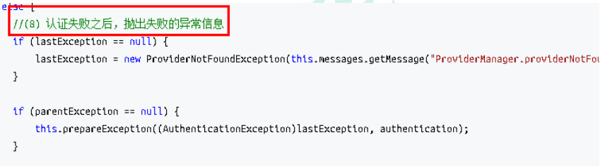
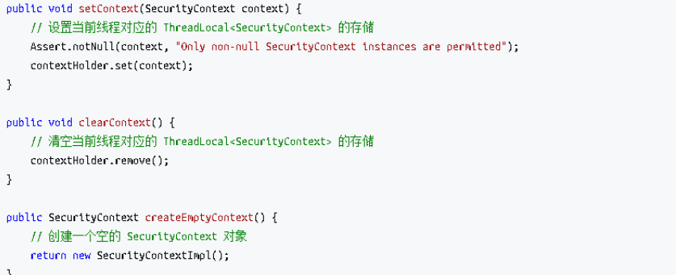

# Spring Security 的过滤器介绍

SpringSecurity 采用的是责任链的设计模式，它有一条很长的过滤器链。现在对这条过滤 器链的 15 个过滤器进行说明:

1. WebAsyncManagerIntegrationFilter：将 Security 上下文与 Spring Web 中用于 处理异步请求映射的 WebAsyncManager 进行集成。
2. SecurityContextPersistenceFilter：在每次请求处理之前将该请求相关的安全上 下文信息加载到 SecurityContextHolder 中，然后在该次请求处理完成之后，将
   SecurityContextHolder 中关于这次请求的信息存储到一个“仓储”中，然后将 SecurityContextHolder 中的信息清除，例如在 Session 中维护一个用户的安全信 息就是这个过滤器处理的。
3. HeaderWriterFilter：用于将头信息加入响应中。
4. CsrfFilter：用于处理跨站请求伪造。
5. LogoutFilter：用于处理退出登录。
6. **UsernamePasswordAuthenticationFilter**：用于处理基于表单的登录请求，从表单中 获取用户名和密码。默认情况下处理来自 /login 的请求。从表单中获取用户名和密码 时，默认使用的表单 name
   值为 username 和 password，这两个值可以通过设置这个 过滤器的 usernameParameter 和 passwordParameter 两个参数的值进行修改。
7. DefaultLoginPageGeneratingFilter：如果没有配置登录页面，那系统初始化时就会 配置这个过滤器，并且用于在需要进行登录时生成一个登录表单页面。
8. BasicAuthenticationFilter：检测和处理 http basic 认证。
9. RequestCacheAwareFilter：用来处理请求的缓存。
10. SecurityContextHolderAwareRequestFilter：主要是包装请求对象 request。
11. AnonymousAuthenticationFilter：检测 SecurityContextHolder 中是否存在 Authentication 对象，如果不存在为其提供一个匿名 Authentication。
12. SessionManagementFilter：管理 session 的过滤器
13. **ExceptionTranslationFilter**：处理 AccessDeniedException 和 AuthenticationException 异常。
14. **FilterSecurityInterceptor**：可以看做过滤器链的出口。
15. RememberMeAuthenticationFilter：当用户没有登录而直接访问资源时, 从 cookie 里找出用户的信息, 如果 Spring Security 能够识别出用户提供的 remember me cookie,
    用户将不必填写用户名和密码, 而是直接登录进入系统，该过滤器默认不开启。

# Spring Security 基本流程

Spring Security 采取**过滤链实现认证与授权**，只有当前过滤器通过，才能进入下一个 过滤器：

绿色部分是认证过滤器，需要我们自己配置，可以配置多个认证过滤器。认证过滤器可以 使用 Spring Security 提供的认证过滤器，也可以自定义过滤器（例如：短信验证）。认证过滤器要在 configure(HttpSecurity
http)方法中配置，没有配置不生效。下面会重 点介绍以下三个过滤器：

- UsernamePasswordAuthenticationFilter 过滤器：该过滤器会拦截前端提交的 POST 方式 的登录表单请求，并进行身份认证。
- ExceptionTranslationFilter 过滤器：该过滤器不需要我们配置，对于前端提交的请求会 直接放行，捕获后续抛出的异常并进行处理（例如：权限访问限制）。
- FilterSecurityInterceptor 过滤器：该过滤器是过滤器链的最后一个过滤器，根据资源 权限配置来判断当前请求是否有权限访问对应的资源。如果访问受限会抛出相关异常，并 由
  ExceptionTranslationFilter 过滤器进行捕获和处理。

# Spring Security 认证流程

认证流程是在 UsernamePasswordAuthenticationFilter 过滤器中处理的，具体流程如下 所示：

## UsernamePasswordAuthenticationFilter 源码

当前端提交的是一个 POST 方式的登录表单请求，就会被该过滤器拦截，并进行身份认 证。该过滤器的 doFilter() 方法实现在其抽象父类 AbstractAuthenticationProcessingFilter **
中，查看相关源码**：

上述的 第二 过程调用了 UsernamePasswordAuthenticationFilter 的 attemptAuthentication() 方法，源码如下：

上述的（3）过程创建的 UsernamePasswordAuthenticationToken 是 Authentication 接口的实现类，该类有两个构造器，一个用于封装前端请求传入的未认
证的用户信息，一个用于封装认证成功后的用户信息：

Authentication 接口的实现类用于存储用户认证信息，查看该接口具体定义：

## ProviderManager 源码

上述过程中，UsernamePasswordAuthenticationFilter 过滤器的 attemptAuthentication() 方法的（5）过程将未认证的 Authentication 对象传入
ProviderManager 类的 authenticate() 方法进行身份认证。

ProviderManager 是 AuthenticationManager 接口的实现类，该接口是认证相关的核心接 口，也是认证的入口。在实际开发中，我们可能有多种不同的认证方式，例如：用户名+
密码、邮箱+密码、手机号+验证码等，而这些认证方式的入口始终只有一个，那就是 AuthenticationManager。在该接口的常用实现类 ProviderManager 内部会维护一个
List列表，存放多种认证方式，实际上这是委托者模式 （Delegate）的应用。每种认证方式对应着一个 AuthenticationProvider， AuthenticationManager 根据认证方式的不同（根据传入的
Authentication 类型判断）委托 对应的 AuthenticationProvider 进行用户认证。

上述认证成功之后的（6）过程，调用 CredentialsContainer 接口定义的 eraseCredentials() 方法去除敏感信息。查看 UsernamePasswordAuthenticationToken 实现的
eraseCredentials() 方法，该方 法实现在其父类中：

### 认证成功/失败处理

上述过程就是认证流程的最核心部分，接下来重新回到 UsernamePasswordAuthenticationFilter 过滤器的 doFilter() 方法，查看认证成 功/失败的处理：

查看 successfulAuthentication() 和 unsuccessfulAuthentication() 源码：

## Spring Security 权限访问流程

上一个部分通过源码的方式介绍了认证流程，下面介绍权限访问流程，主要是对 ExceptionTranslationFilter 过滤器和 FilterSecurityInterceptor 过滤器进行介绍。

### ExceptionTranslationFilter 过滤器

该过滤器是用于处理异常的，不需要我们配置，对于前端提交的请求会直接放行，捕获后 续抛出的异常并进行处理（例如：权限访问限制）。具体源码如下：

### FilterSecurityInterceptor 过滤器

​ FilterSecurityInterceptor 是过滤器链的最后一个过滤器，该过滤器是过滤器链 的最后一个过滤器，根据资源权限配置来判断当前请求是否有权限访问对应的资源。如果 访问受限会抛出相关异常，最终所抛出的异常会由前一个过滤器
ExceptionTranslationFilter 进行捕获和处理。具体源码如下：

需要注意，Spring Security 的过滤器链是配置在 SpringMVC 的核心组件 DispatcherServlet 运行之前。也就是说，请求通过 Spring Security 的所有过滤器，
不意味着能够正常访问资源，该请求还需要通过 SpringMVC 的拦截器链。

## Spring Security 请求间共享认证信息

一般认证成功后的用户信息是通过 Session 在多个请求之间共享，那么 Spring Security 中是如何实现将已认证的用户信息对象 Authentication 与 Session 绑定的进行 具体分析。

在前面讲解认证成功的处理方法 successfulAuthentication() 时，有以下代码：

查 看 SecurityContext 接 口 及 其 实 现 类 SecurityContextImpl ， 该 类 其 实 就 是 对 Authentication 的封装：

查 看 SecurityContextHolder 类 ， 该 类 其 实 是 对 ThreadLocal 的 封 装 ， 存 储 SecurityContext 对象：

### SecurityContextPersistenceFilter 过滤器

前面提到过，在 UsernamePasswordAuthenticationFilter 过滤器认证成功之 后，会在认证成功的处理方法中将已认证的用户信息对象 Authentication 封装进 SecurityContext，并存入
SecurityContextHolder。

之后，响应会通过 SecurityContextPersistenceFilter 过滤器，该过滤器的位置 在所有过滤器的最前面，请求到来先进它，响应返回最后一个通过它，所以在该过滤器中 处理已认证的用户信息对象
Authentication 与 Session 绑定。

认证成功的响应通过 SecurityContextPersistenceFilter 过滤器时，会从 SecurityContextHolder 中取出封装了已认证用户信息对象 Authentication 的
SecurityContext，放进 Session 中。当请求再次到来时，请求首先经过该过滤器，该过滤 器会判断当前请求的 Session 是否存有 SecurityContext 对象，如果有则将该对象取出再次 放入
SecurityContextHolder 中，之后该请求所在的线程获得认证用户信息，后续的资源访 问不需要进行身份认证；当响应再次返回时，该过滤器同样从 SecurityContextHolder 取出 SecurityContext
对象，放入 Session 中。具体源码如下：

