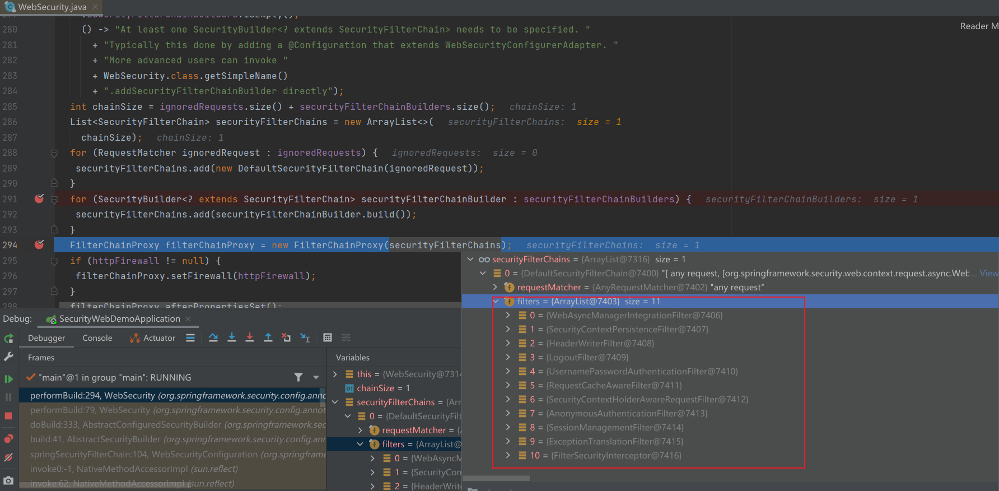
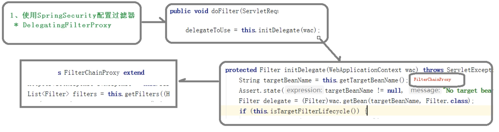
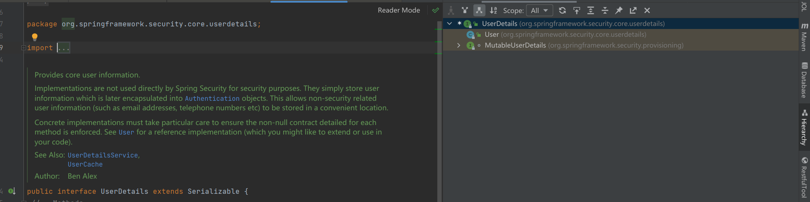
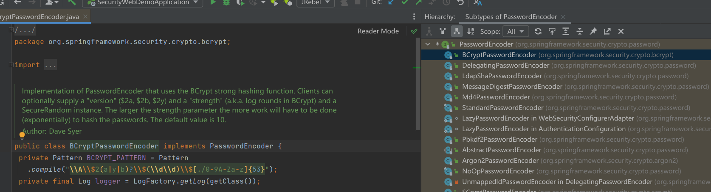

# SpringSecurity 框架简介

SpringBoot 对 Security
的自动配置：https://docs.spring.io/spring-security/site/docs/5.3.4.RELEASE/reference/html5/#servlet-hello

SpringSecurity 权限表达式：https://docs.spring.io/spring-security/site/docs/5.3.4.RELEASE/reference/html5/#el-access

## 概要

正如你可能知道的关于安全方面的两个主要区域是“**认证**”和“**授权**”（或者访问控 制），一般来说，Web 应用的安全性包括**用户认证（Authentication）和用户授权 （Authorization）**
两个部分，这两点也是 Spring Security 重要核心功能。

（1）用户认证指的是：验证某个用户是否为系统中的合法主体，也就是说用户能否访问 该系统。用户认证一般要求用户提供用户名和密码。系统通过校验用户名和密码来完成认 证过程。**通俗点说就是系统认为用户是否能登录**

（2）用户授权指的是验证某个用户是否有权限执行某个操作。在一个系统中，不同用户 所具有的权限是不同的。比如对一个文件来说，有的用户只能进行读取，而有的用户可以 进行修改。一般来说，系统会为不同的用户分配不同的角色，而每个角色则对应一系列的
权限。**通俗点讲就是系统判断用户是否有权限去做某些事情**。

## 权限框架对比

SpringSecurity 特点：

- 和 Spring 无缝整合。
- 全面的权限控制。
- 专门为 Web 开发而设计。
    - 旧版本不能脱离 Web 环境使用。
    - 新版本对整个框架进行了分层抽取，分成了核心模块和 Web 模块。单独 引入核心模块就可以脱离 Web 环境。
- 重量级。

Shiro特点：

- 轻量级。Shiro 主张的理念是把复杂的事情变简单。针对对性能有更高要求 的互联网应用有更好表现。
- 通用性。
    - 好处：不局限于 Web 环境，可以脱离 Web 环境使用。
    - 缺陷：在 Web 环境下一些特定的需求需要手动编写代码定制。

## 权限框架使用建议

一般来说，常见的安全管理技术栈的组合是这样的：

- SSM + Shiro
- Spring Boot/Spring Cloud + Spring Security

**以上只是一个推荐的组合而已，如果单纯从技术上来说，无论怎么组合，都是可以运行的**

# 原理

SpringSecurity 本质是一个过滤器链

## SpringSecurity 过滤器介绍

代码底层流程，重点看下面几个过滤器：

- FilterSecurityInterceptor：是一个方法级的权限过滤器, 基本位于过滤链的最底部(最后一个过滤器)。
- org.springframework.security.web.access.ExceptionTranslationFilter：是个异常过滤器，用来处理在认证授权过程中抛出的异常
- UsernamePasswordAuthenticationFilter ：校验请求参数(username,password)
- RememberMeAuthenticationFilter：从request头中获取 cookie,取出cookie里面的值，然后调用 PersistentTokenRepository#getTokenForSeries
  读取信息，判断是有登录状态

所有的过滤器信息

```shell
org.springframework.security.web.context.request.async.WebAsyncManagerIntegrationFilter 

org.springframework.security.web.context.SecurityContextPersistenceFilter 

org.springframework.security.web.header.HeaderWriterFilter 

org.springframework.security.web.csrf.CsrfFilter 

org.springframework.security.web.authentication.logout.LogoutFilter 

org.springframework.security.web.authentication.UsernamePasswordAuthenticationFilter 

org.springframework.security.web.authentication.ui.DefaultLoginPageGeneratingFilter 

org.springframework.security.web.authentication.ui.DefaultLogoutPageGeneratingFilter 

org.springframework.security.web.savedrequest.RequestCacheAwareFilter 

org.springframework.security.web.servletapi.SecurityContextHolderAwareRequestFilter 

org.springframework.security.web.authentication.AnonymousAuthenticationFilter 

org.springframework.security.web.session.SessionManagementFilter 

org.springframework.security.web.access.ExceptionTranslationFilter 

org.springframework.security.web.access.intercept.FilterSecurityInterceptor


```

## 过滤器是如何进行加载的

要使用 SpringSecurity 需要配置 DelegatingFilterProxy ，这是个过滤器，具体的工作原理如下：

1. DelegatingFilterProxy 他的 doFilter 会执行 `delegateToUse = initDelegate(wac);`
2. initDelegate 是从容其中获取 名叫 `FilterChainProxy` 的类
2. DelegatingFilterProxy 真正的执行是逻辑 `invokeDelegate(delegateToUse, request, response, filterChain);`
2. invokeDelegate 执行逻辑是 delegateToUse.doFilter，而 delegateToUse 其实就是 `FilterChainProxy`
2. 所以应该看 `FilterChainProxy` 的 doFilter 方法如何执行的
6. `FilterChainProxy` 的 doFilter 其实是拿到所有符合的 SecurityFilter 然后遍历这些过滤器  `List<Filter> filters = getFilters(fwRequest);`

SpringBoot项目默认注册的bean



大概的执行逻辑



## 认证基本原理

```java
UsernamePasswordAuthenticationFilter
  	doFilter
  		this.getAuthenticationManager().authenticate(authRequest) // 遍历所有的 AuthenticationProvider，通过 provider#supports 判断是否匹配
  			AuthenticationProvider.authenticate
```

```java
public interface AuthenticationManager {
	Authentication authenticate(Authentication authentication)
			throws AuthenticationException;
}
```

```java
public interface AuthenticationProvider {
	Authentication authenticate(Authentication authentication)
			throws AuthenticationException;
	boolean supports(Class<?> authentication);
```

AuthenticationProvider 有两个带模板方法的抽象类

```java
public abstract class AbstractJaasAuthenticationProvider implements AuthenticationProvider{
	public Authentication authenticate(Authentication auth)
			throws AuthenticationException {
    // createLoginContext;
  }
  
  protected abstract LoginContext createLoginContext(CallbackHandler handler)
			throws LoginException;
}
```

```java
public abstract class AbstractUserDetailsAuthenticationProvider implements AuthenticationProvider{
  public Authentication authenticate(Authentication authentication)
			throws AuthenticationException {
    // this.additionalAuthenticationChecks
  }
  
  // 一般继承这个抽象类的实现类 DaoAuthenticationProvider，然后重写 additionalAuthenticationChecks 来增加系统自定义的认证逻辑
  protected abstract void additionalAuthenticationChecks(UserDetails userDetails,
                                                         UsernamePasswordAuthenticationToken authentication)
    throws AuthenticationException;
}
```

## 方法鉴权原理

配置权限

```java
@Configuration
public class SecurityConfig1 extends WebSecurityConfigurerAdapter {
    @Override
    protected void configure(HttpSecurity http) throws Exception {
        // 配置资源权限
        http
            .authorizeRequests()
            .antMatchers("/index", "/allow*", "/login.html", "*.css", "*.js") //表示配置请求路径
            .permitAll() // 指定 URL 无需保护。
            .antMatchers("/findAll")
            .hasAuthority("admins") // 需要用户带有admins 权限
            .antMatchers("/find")
            .hasAnyAuthority("role") // 需要主体带有 role 权限
            .antMatchers("/test/role")
            .hasRole("sale")
            .antMatchers("/test/roles")
            .hasAnyRole("xx", "sale")
            .anyRequest() // 其他请求
            .authenticated(); //需要认证
    }
}
```

鉴权代码原理：

```java
AbstractSecurityInterceptor#beforeInvocation
  Collection<ConfigAttribute> attributes = this.obtainSecurityMetadataSource()
				.getAttributes(object); // 获取配置属性，就是遍历我们配置的HttpSecurity 找到符合的
	AbstractAccessDecisionManager#decide // 遍历AccessDecisionVoter#vote
  	  AccessDecisionVoter#vote
```

```java
// DefaultFilterInvocationSecurityMetadataSource
public Collection<ConfigAttribute> getAttributes(Object object) {
		final HttpServletRequest request = ((FilterInvocation) object).getRequest();
		for (Map.Entry<RequestMatcher, Collection<ConfigAttribute>> entry : requestMap
				.entrySet()) {
			if (entry.getKey().matches(request)) {
				return entry.getValue();
			}
		}
		return null;
	}
```

```java
// 1. 拦截器拦截
org.springframework.security.web.access.intercept.FilterSecurityInterceptor#invoke
    	// 2. Filter放行前的处理
    	InterceptorStatusToken token = super.beforeInvocation(fi);
// 2. Filter放行前的处理
org.springframework.security.access.intercept.AbstractSecurityInterceptor#beforeInvocation
    	// 3. 判断权限
    	this.accessDecisionManager.decide(authenticated, object, attributes)
// 3. 判断权限
org.springframework.security.access.vote.AffirmativeBased#decide
    // 4. 遍历所有的 AccessDecisionVoter 进行鉴权，只要一个鉴别失败
    for (AccessDecisionVoter voter : getDecisionVoters()) {
		int result = voter.vote(authentication, object, configAttributes);
       	 // 选举结果失败，就抛出异常
         if (result == -1) {
			throw new AccessDeniedException(messages.getMessage(
					"AbstractAccessDecisionManager.accessDenied", "Access is denied"));
		}
    }
// 5. WebExpressionVoter 选举的核心逻辑
org.springframework.security.web.access.expression.WebExpressionVoter#vote
    return ExpressionUtils.evaluateAsBoolean(weca.getAuthorizeExpression(), ctx) ? ACCESS_GRANTED
				: ACCESS_DENIED;
    	
```

当前主体是否具有权限是根据 `UserDetailsService#loadUserByUsername` 返回值 `UserDetails`,里面封装了该主体具有的权限信息

```java
public interface UserDetailsService { 
	UserDetails loadUserByUsername(String username) throws UsernameNotFoundException;
}
```

```java
public interface UserDetails extends Serializable {
	Collection<? extends GrantedAuthority> getAuthorities();
	String getPassword();
	String getUsername();
	boolean isAccountNonExpired();
	boolean isAccountNonLocked();
	boolean isCredentialsNonExpired();
	boolean isEnabled();
}
```

# 使用 Spring Security

## UserDetailsService 接口讲解

当什么也没有配置的时候，账号和密码是由 Spring Security 定义生成的。而在实际项目中 账号和密码都是从数据库中查询出来的。 所以我们要通过**自定义逻辑控制认证逻辑**。 如果需要自定义逻辑时，只需要**
实现** `UserDetailsService` 接口即可

```java
package org.springframework.security.core.userdetails;

public interface UserDetailsService {
    UserDetails loadUserByUsername(String var1) throws UsernameNotFoundException;
}

```

`loadUserByUsername` 接口返回值`UserDetails`，这个是系统默认的用户("**主体**")

```java
public interface UserDetails extends Serializable {
    // 表示获取登录用户所有权限
    Collection<? extends GrantedAuthority> getAuthorities();
    // 表示获取密码
    String getPassword();
    // 表示获取用户名
    String getUsername();
    // 表示判断账户是否过期
    boolean isAccountNonExpired();
    // 表示判断账户是否被锁定
    boolean isAccountNonLocked();
    // 表示凭证{密码}是否过期
    boolean isCredentialsNonExpired();
    // 表示当前用户是否可用
    boolean isEnabled();
}

```

SpringSecurity 中有默认的UserDetails，一般使用 User 就可以了



## PasswordEncoder 接口讲解

```java
public interface PasswordEncoder {
  	// 表示把参数按照特定的解析规则进行解析
    String encode(CharSequence rawPassword);
    // 表示验证从存储中获取的编码密码与编码后提交的原始密码是否匹配。如果密码匹配，则返回 true；如果不匹配，则返回 false。第一个参数表示需要被解析的密码。第二个参数表示存储的密码。
    boolean matches(CharSequence rawPassword, String encodedPassword);
    // 表示如果解析的密码能够再次进行解析且达到更安全的结果则返回 true，否则返回
    default boolean upgradeEncoding(String encodedPassword) {return false;}

}
```

`BCryptPasswordEncoder` 是 Spring Security 官方推荐的密码解析器，平时多使用这个解析 器。 BCryptPasswordEncoder 是对 bcrypt 强散列方法的具体实现。是基于 Hash
算法实现的单 向加密。可以通过 strength 控制加密强度，默认 10.



## WebSecurityConfigurerAdapter

```java
@Configuration
public class SecurityConfig1 extends WebSecurityConfigurerAdapter {
    @Override
    protected void configure(HttpSecurity http) throws Exception {}; // 配置认证、配置资源权限等


    @Override
    public void configure(AuthenticationManagerBuilder auth) throws Exception{ // 用户信息，密码处理
        auth.userDetailsService(userDetailsService).passwordEncoder(defaultPasswordEncoder);
    }
	
    @Override
    public void configure(WebSecurity web) throws Exception { // 配置哪些请求不拦截
        web.ignoring().antMatchers("/api/**" , "/swagger-ui.html/**");
    }
}

```

## 配置登录页面信息

```java
@Configuration
public class SecurityConfig1 extends WebSecurityConfigurerAdapter {
		@Override
		protected void configure(HttpSecurity http) throws Exception {
				// 配置认证
				http
                    .formLogin()
                    .loginPage("/login.html") // 配置哪个 url 为登录页面
                    .loginProcessingUrl("/dologin") // 设置哪个是登录的 url。
                    // .defaultSuccessUrl("/allow-success.html") // 登录成功之后跳转到哪个 url
                    .successForwardUrl("/success") // 登录成功之后跳转到哪个 url
                    // .failureUrl("/allow-fail.html");// 登录失败之后跳转到哪个 url
                    .failureForwardUrl("/fail")// 登录失败之后跳转到哪个 url
                    .usernameParameter("name") // 获取用户名的参数
                    .passwordParameter("pwd"); // 获取密码的参数
		}
}
```

## 配置资源授权

```java
@Configuration
public class SecurityConfig1 extends WebSecurityConfigurerAdapter {
		@Override
		protected void configure(HttpSecurity http) throws Exception {
				// 配置资源权限
				http
                    .authorizeRequests()
                    .antMatchers("/index", "/allow*", "/login.html", "*.css", "*.js") //表示配置请求路径
                    .permitAll() // 指定 URL 无需保护。
                    .anyRequest() // 其他请求
                    .authenticated(); //需要认证
		}
}
```

## 基于角色或权限进行访问控制

hasAuthority 方法：如果当前的主体具有指定的权限，则返回 true,否则返回 false

hasAnyAuthority 方法： 如果当前的主体有任何提供的角色（给定的作为一个逗号分隔的字符串列表）的话，返回 true.

hasRole 方法：如果用户具备给定角色就允许访问,否则出现 403。 如果当前主体具有指定的角色，则返回 true。

hasAnyRole 方法：表示用户具备任何一个条件都可以访问。

```java
@Configuration
public class SecurityConfig1 extends WebSecurityConfigurerAdapter {
    @Override
    protected void configure(HttpSecurity http) throws Exception {
        // 配置资源权限
        http
            .authorizeRequests()
            .antMatchers("/index", "/allow*", "/login.html", "*.css", "*.js") //表示配置请求路径
            .permitAll() // 指定 URL 无需保护。
            .antMatchers("/findAll")
            .hasAuthority("admins") // 需要用户带有admins 权限
            .antMatchers("/find")
            .hasAnyAuthority("role") // 需要主体带有 role 权限
            .antMatchers("/test/role")
            .hasRole("sale")
            .antMatchers("/test/roles")
            .hasAnyRole("xx", "sale")
            .anyRequest() // 其他请求
            .authenticated(); //需要认证
    }
}
```

## 配置403页面

```java
@Configuration
public class SecurityConfig1 extends WebSecurityConfigurerAdapter {
    @Override
    protected void configure(HttpSecurity http) throws Exception {

        // 配置 403 页面
        http
            .exceptionHandling()
            .accessDeniedPage("/unauth")
            .anyRequest() // 其他请求
            .authenticated(); //需要认证
    }
}
```

## 注解使用

实现该功能的过滤器：FilterSecurityInterceptor

### @Secured

判断是否具有角色，另外需要注意的是这里匹配的字符串需要添加前缀“ROLE_“。

使用注解先要开启注解功能！`@EnableGlobalMethodSecurity(securedEnabled=true)`

```java
@Controller
public class SecurityConfig2Controller {
    // 测试注解：
    @RequestMapping("testSecured")
    @ResponseBody
    @Secured({"ROLE_normal", "ROLE_admin"})
    public String helloUser() {
        return "hello,user";
    }
}
```

### @PreAuthorize

使用注解先要开启注解功能！ `@EnableGlobalMethodSecurity(prePostEnabled = true)`

@PreAuthorize：**注解适合进入方法前的权限验证**， @PreAuthorize 可以将登录用户的 roles/permissions 参数传到方法中，**就是可以写表达式**

```java
@Controller
public class SecurityConfig2Controller {

    @RequestMapping("/preAuthorize")
    @ResponseBody
    // @PreAuthorize("hasRole('ROLE_管理员')")
    @PreAuthorize("hasAnyAuthority('menu:system')")
    public String preAuthorize() {
        System.out.println("preAuthorize");
        return "preAuthorize";
    }

}

```

### @PostAuthorize

使用注解先要开启注解功能！`@EnableGlobalMethodSecurity(prePostEnabled = true) `

@PostAuthorize 注解使用并不多，**在方法执行后再进行权限验证**，适合验证带有返回值 的权限.

```java
@RequestMapping("/testPostAuthorize")
@ResponseBody
@PostAuthorize("hasAnyAuthority('menu:system2')")
public String postAuthorize() {
    System.out.println("test--PostAuthorize");
    return "PostAuthorize";
}
```

### @PostFilter

@PostFilter ：权限验证之后对数据进行过滤 留下用户名是 admin1 的数据

表达式中的 filterObject 引用的是方法返回值 List 中的某一个元素

```java
@RequestMapping("getAll")
@PreAuthorize("hasRole('ROLE_管理员')")
@PostFilter("filterObject.username == 'admin1'")
@ResponseBody
public List<Users> getAllUser() {
    ArrayList<Users> list = new ArrayList<>();
    list.add(new Users(1l, "admin1", "6666"));
    list.add(new Users(2l, "admin2", "888"));
    return list;
}
```

### @PreFilter

@PreFilter: 进入控制器之前对数据进行过滤

```java
@RequestMapping("getTestPreFilter")
@PreAuthorize("hasRole('ROLE_管理员')")
@PreFilter(value = "filterObject.id%2==0")
@ResponseBody
public List<UserInfo> getTestPreFilter(@RequestBody List<UserInfo> list){
    list.forEach(t-> {
        System.out.println(t.getId()+"\t"+t.getUsername());
    });
    return list;
}

```

## 基于数据库的记住我

实现该功能的过滤器：RememberMeAuthenticationFilter

```java
@Configuration
public class SecurityConfig3 extends WebSecurityConfigurerAdapter {
    @Autowired
    private DataSource dataSource;
    @Autowired
    private MyUserDetailsService3 usersService;

    @Bean
    public PersistentTokenRepository persistentTokenRepository() {
        JdbcTokenRepositoryImpl jdbcTokenRepository = new JdbcTokenRepositoryImpl();
        // 赋值数据源
        jdbcTokenRepository.setDataSource(dataSource);
        // 自动创建表,第一次执行会创建，以后要执行就要删除掉！
        // jdbcTokenRepository.setCreateTableOnStartup(true);
        return jdbcTokenRepository;
    }

    @Override
    protected void configure(HttpSecurity http) throws Exception {
        // 开启记住我功能
        http
            .rememberMe()
            .tokenValiditySeconds(120)
            .tokenRepository(persistentTokenRepository())
            .userDetailsService(usersService);
    }
}
```

## 用户注销

```java
http.logout().logoutUrl("/logout").logoutSuccessUrl("/index").permitAll
```

## CSRF

通过 CsrfFilter 过滤器来完成

跨站请求伪造（英语：Cross-site request forgery）

从 Spring Security 4.0 开始，默认情况下会**启用 CSRF 保护**，以防止 CSRF 攻击应用 程序，Spring Security CSRF 会针对 PATCH，POST，PUT 和 DELETE 方法进行防护。

```java
http
    .csrf()
    .disable();
```

# security-web-demo

## 不登录直接访问资源为什么会重定向到 /login

项目启动 -> `http://localhost:8080/test/hello` -> 重定向到 `http://localhost:8111/login`

主要的过滤器：ExceptionTranslationFilter -> FilterSecurityInterceptor

```java
FilterSecurityInterceptor
	doFilter
		invoke
			InterceptorStatusToken token = super.beforeInvocation(fi); 
				this.accessDecisionManager.decide(authenticated, object, attributes); //抛出异常

// 因为过滤器链中，ExceptionTranslationFilter 在 FilterSecurityInterceptor 前面执行，所以异常能被 ExceptionTranslationFilter 捕获到
ExceptionTranslationFilter
    doFilter
        try {
            chain.doFilter(request, response);
        }
        catch (Exception var10) {
            // 这里面其实就是往 response设置返回信息
            this.handleSpringSecurityException(request, response, chain, (RuntimeException)ase);
        }
```

## 如何校验登录信息的

问题：

- 如何注册AuthenticationProvider
- 如何 往 AuthenticationProvider 里面设置 UserDetailsService

主要的过滤器：UsernamePasswordAuthenticationFilter

```java
UsernamePasswordAuthenticationFilter
    doFilter
    	 // 默认会拦截 /login
    	if(!requiresAuthentication(request, response)) chain.doFilter(request, response); 
	
		// 符合过滤器拦截规则 执行认证逻辑（会从request中 获取 username 和 password 参数的值）
		authResult = attemptAuthentication(request, response);
			this.getAuthenticationManager().authenticate(authRequest);
				// 遍历所有的 AuthenticationProvider 找到适配的在进行认证,如果认证结果为空，尝试使用 parent进行认证
    			for (AuthenticationProvider provider : getProviders()) {
                    if (!provider.supports(toTest)) {
                        continue;
                    }
                    result = provider.authenticate(authentication); // 进行认证（详细代码看下面）
                    if (result == null && parent != null) {
					// Allow the parent to try.
					result = parentResult = parent.authenticate(authentication);
                	}
                 }
```

AbstractUserDetailsAuthenticationProvider.authenticate

```java
// 从缓存里面获取用户
UserDetails user = this.userCache.getUserFromCache(username);
if (user == null) {
    // 就是通过 UserDetailsService#loadUserByUsername 获取用户信息
    user = retrieveUser(username, (UsernamePasswordAuthenticationToken) authentication);
}

// user != null ,进行密码校验
additionalAuthenticationChecks(user,
					(UsernamePasswordAuthenticationToken) authentication);
	// 密码校验就是通过 PasswordEncoder 来判断是否正确
```

AuthenticationProvider 接口定义如下

```java
package org.springframework.security.authentication;

public interface AuthenticationProvider {
	Authentication authenticate(Authentication authentication) throws AuthenticationException;
	boolean supports(Class<?> authentication);
}
```

# SpringSecurity 微服务权限方案

