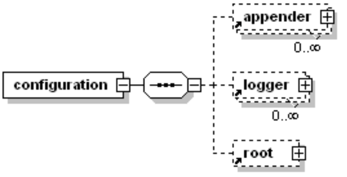

## 参看文章

原文链接：https://mianshenglee.github.io/2019/11/28/logback1.html

## logback简要介绍

logback官网地址： http://logback.qos.ch，从官网的介绍， logback是log4j框架的作者开发的新一代日志框架，是log4j的继任者，它更快，更小， 效率更高、能够适应各种运行环境，同时天然支持slf4j。
slf4j，即Simple Logging Facade For Java，它是对各类日志框架的统一抽象，即定义了接口，具体使用哪个日志 框架由运行时绑定实现。

logback主要由三个模块构成，分别是 logback-core ， logback-classic 及 logback-access
，其中logback-core是基础核心，另外两个均依赖它。logback-classic实现了简单日志门面SLF4J；而logback-access主要作为一个与Servlet容器交互的模块，如tomcat或者jetty，提供与HTTP访问相关的一些功能。

明确概念：

- slf4j 是 日记接口规范
- log4j 是 slf4j 的实现
- logback 是 slf4j 的实现
- logback是log4j框架的作者开发的新一代日志框架，是log4j的继任者
- springboot默认日志框架-logback
- 日记级别 debugger -> info -> warn -> error

## 快速使用 logback

依赖：

```xml
<dependency>
    <groupId>org.slf4j</groupId>
    <artifactId>slf4j-api</artifactId>
    <version>1.7.36</version>
</dependency>
<dependency>
    <groupId>ch.qos.logback</groupId>
    <artifactId>logback-core</artifactId>
    <version>1.2.10</version>
</dependency>
<dependency>
    <groupId>ch.qos.logback</groupId>
    <artifactId>logback-classic</artifactId>
    <version>1.2.10</version>
</dependency>
```

配置文件：logback.xml

代码：`Logger log = LoggerFactory.getLogger(Quickstart.class);`

## 配置logback 信息

### 在 springboot 配置文件 设置 日志信息

- 日志级别控制，设置格式为logging.leve.*=LEVEL，其中*为包名或logger名，LEVEL有： TRACE, DEBUG, INFO, WARN, ERROR, FATAL, OFF 。
- 日志输出到文件，默认日志只输出到控制台，不写文件，可以配置logging.file.name或logging.file.path来指定日志输出文件。
    - logging.file.name设置文件， 会在项目的当前路径下生成此文件名的日志文件 。
    - logging.path设置目录，会在此目录下创建spring.log文件。 默认情况下，日志文件的大小达到10MB时会切分一次，产生新的日志文件

      > 注意： 二者不能同时使用，如若同时使用，则只有logging.file生效

### 自定义logback配置

上面在properties文件中对日志进行基本的配置，但配置能力较弱，不够灵活。因此一般都使用自定义配置，**通过xml文件对logback的日志输出进行配置**。

## logback配置文件加载顺序

在springboot应用中，对于logback的配置文件，默认情况下，配置文件放在src/main/resources下，支持的配置文件名称如下：

- logback-spring.xml
- logback-spring.groovy
- logback.xml
- logback.groovy

Spring Boot官方推荐优先使用带有-spring的文件名配置（如有logback-spring.xml，则不会使用logback.xml） 。 当然，若需要对配置文件名进行修改，或者希望把配置文件放到其它目录下，可以通过**
logging.config属性指定自定义的名字**，如logging.config=classpath:config/log-config.xml，则使用resources/config下的log-config.xml配置。
> 注，一般情况下，按默认规则（在resources目录下，使用logback-spring.xml）即可。另外有了这个配置文件后，前面提到的在properties文件中的logging配置则不需要了。

## logback配置文件的详述及使用

logback配置文件决定日志输出格式、日志输出位置、输出文件策略等内容，因此需要对logback配置文件的结构及相关元素内容进行了解。

### 配置文件结构

配置文件总体来说内容比较简单，主要三个元素：


- 这三个元素中，logger和root可视为同一类，都是日志组件
- 可以把root当作是特殊logger，是根，必须配置。
- logger配置解答从哪里获取日志，输出什么级别日志问题。
- appender配置是指出日志以什么格式输出，日志如何过滤，输出文件后如何处理的问题。
- 另外，还有可选的property及contextName元素，变量和应用上下文名称。

#### 根元素configuration

根元素configuration有三个属性可以设置，如下：

- debug：默认为false，若设置为true，则打印出logback内部日志信息
- scan：默认值为true，若设置为true，配置文件如果发生改变，将会被重新加载。
-
scanPeriod：与scan配合使用，当scan为true时，此属性生效，默认的时间间隔为1分钟，设置监测配置文件是否有修改的时间间隔，如果没有给出时间单位，默认单位是毫秒。如可以设置为`scanPeriod="30 seconds"`
每30秒检测一次。

```xml
<configuration scan="true" scanPeriod="1 seconds">
  ...
</configuration>
```

#### 定义上下文名称和变量

- contextName元素，每一个日志组件（logger）都会关联到日志上下文，默认上下文名称是’default’，用于标识应用，如果多个应用输出到同一个地方，就有必要使用`%contextName`来区别。
-
property元素，定义变量，有name和value属性，定义变量后，可以使“${name}”来使用变量。在配置中多个地方的值使用到相同的内容时，就有必要把相同内容设置变量，通过引用来设置。如示例工程中的日志文件名称前缀、日志路径、日志输出格式。

> 注意，定义的变量只能在配置文件的值中(标签体)进行引用，不能在元素属性中引用。如配置文件中有很多属性是class，里面的内容只能写类的全路径，尽管类前缀都相同，但不能用变量替换。

```xml
<configuration scan="true" scanPeriod="1 seconds">
  <property name="logfile.prefix" value="logback-demo"/>
  <appender name="STDOUT" class="ch.qos.logback.core.ConsoleAppender">
        <layout class="ch.qos.logback.classic.PatternLayout">
            <pattern>${log.pattern}</pattern>
        </layout>
  </appender>
</configuration>
```

#### 日志输出组件appender

此元素是主要配置项，表示以**什么格式输出**，**日志如何过滤**，**输出文件后如何处理**。appender结构如下：


**appender** 有两个属性 **name和class**;name指定appender名称，class指定appender的全限定名。appender 默认有以下几种：

- ConsoleAppender：把日志添加到控制台，类名ch.qos.logback.core.ConsoleAppender
- FileAppender：把日志添加到文件，类名ch.qos.logback.core.FileAppender
-
RollingFileAppender：滚动记录文件，FileAppender的子类，当符合条件（大小、时间），日志进行切分，记录到其他文件。类名：ch.qos.logback.core.rolling.RollingFileAppender。

> 实践过程中，一般使用ConsoleAppender及RollingFileAppender即可，若需要自定义如把日志输出到消息队列，可以自定义实现 AppenderBase 接口。

ConsoleAppender比较简单，只需要使用layout元素，按日志输出格式即可，如下：

```xml
<!-- 控制台输出日志 -->
<appender name="STDOUT" class="ch.qos.logback.core.ConsoleAppender">
    <layout class="ch.qos.logback.classic.PatternLayout">
        <pattern>${log.pattern}</pattern>
    </layout>
</appender>
```

RollingFileAppender的配置相对多一点，包括File、filter，rollingPolicy，encoder和layout元素。其中filter可以过滤日志，因此，若需要把日志按级别输出到不同的文件中，因此，定义多个RollingFileAppender（如对应DEBUG、INFO、WARN、ERROR），分别按日志级别过滤即可。下面分别进行说明：

##### File 标签

配置文件输出的路径及文件名，一般把路径和文件名前缀定义到变量(property中)，如下：

```xml
<!--日志文件前缀，即应用名称 -->
<property name="logfile.prefix" value="logback-demo"/>
<!--日志路径，可写相对路径，也可写绝对路径 -->
<property name="log.path" value="logs"/>
...//略
<File>${log.path}/${logfile.prefix}-debug.log</File>
```

##### Filter 标签

filter可以为**appender** 添加一个或多个过滤器，对日志进行过滤。过滤器有**ThresholdFilter**和**LevelFilter**
，前者是临界值过滤器，过滤掉低于指定临界值的日志；后者是级别过滤器，根据日志级别进行过滤， 如果日志级别等于配置级别 ，过滤器会根据**onMath(符合过滤条件的操作)** 和 **onMismatch(不符合过滤条件的操作)**
接收（ACCEPT）或拒绝（DENY）日志。 按前面需求，把日志按不同级别分别输出到各自文件中，需要多个RollingFileAppender元素，每个元素下对应的level是DEBUG，INFO，WARN和ERROR。

##### RollingPolicy 标签

此元素描述滚动策略，有**TimeBasedRollingPolicy**、**SizeAndTimeBasedRollingPolicy**
、FixedWindowRollingPolicy、SizeBasedTriggeringPolicy。分别是基于时间滚动，基于大小和时间滚动，固定窗口滚动和大小触发，其中FixedWindowRollingPolicy一般和SizeBasedTriggeringPolicy同时使用。下面以TimeBasedRollingPolicy为例，以天为单位输出日志，每天一个日志。

```xml
<rollingPolicy class="ch.qos.logback.core.rolling.TimeBasedRollingPolicy">
    <!-- 日志输出格式 -->
    <FileNamePattern>${log.path}/${logfile.prefix}-debug.%d{yyyy-MM-dd}.log</FileNamePattern>
    <!-- 日志保留天数 -->
    <maxHistory>30</maxHistory>
</rollingPolicy>
```

**FileNamePattern**表示日志的路径及名称，此处是按日期输出，即%d{yyyy-MM-dd}格式。maxHistory表示日志最多保留天数，大于这些天数后，前面的日志会删除。

对于SizeAndTimeBasedRollingPolicy，如下所示：

```xml
<!-- 按日期滚动 -->
<fileNamePattern>mylog-%d{yyyy-MM-dd}.%i.txt</fileNamePattern>
<!-- 文件大小最大是100M，保存60日，总大小最大为20G -->
<maxFileSize>100MB</maxFileSize>    
<maxHistory>60</maxHistory>
<totalSizeCap>20GB</totalSizeCap>
```

> 注意，％i和％d标识符都是强制性的。 每当日志文件在当前时间段结束之前达到文件最大值时，它将以递增的%d索引存档，从0开始。

##### layout 标签

layout元素较简单，只需要设置输出的格式即可。

```xml
<property name="log.pattern"
              value="%d{yyyy-MM-dd HH:mm:ss.SSS} %5level [%15thread] %40.40logger{40} [%10method,%line] : %msg%n"/>
...
<layout class="ch.qos.logback.classic.PatternLayout">
    <Pattern>${log.pattern}</Pattern>
</layout>
```

#### 输出格式控制

对于日志输出格式的控制，使用logback的保留字进行控制，保留字很多，建议查阅[官网文档](https://logback.qos.ch/manual/layouts.html)，下面对常用进行说明：

| 保留字                                                | 作用                                                         |
| :---------------------------------------------------- | :----------------------------------------------------------- |
| **c**{*length*} **lo**{*length*} **logger**{*
length*} | 输出日志的logger名，可有一个整型参数，功能是缩短logger名，最右的点符号之后的类名始终显示，设置为0表示只输入logger最右边点符号之后的字符串。 |
| **C**{*length*} **class**{*length*}                   | 输出执行记录请求的调用者的全限定名。参数与上面的一样。尽量避免使用，除非执行速度不造成任何问题。 |
| **contextName** **cn**                                | 输出上下文名称。                                             |
| **d**{*pattern*} **date**{*pattern*}                  | 输出日志的打印日志，模式语法与java.text.SimpleDateFormat兼容。 |
| **L / line**                                          | 输出执行日志请求的行号。尽量避免使用，除非执行速度不造成任何问题。 |
| **m / msg / message**                                 | 输出应用程序提供的信息。                                     |
| **M / method**                                        | 输出执行日志请求的方法名。尽量避免使用，除非执行速度不造成任何问题。 |
| **n**                                                 | 输出平台相关的分行符“\n”或者“\r\n”。                         |
| **p / le / level**                                    | 输出日志级别。                                               |
| **t / thread**                                        | 输出产生日志的线程名。                                       |

另外，格式还有一个对齐功能，通过在`%`后面添加`-`、`.`及数字进行控制。符号`-`是可选修饰符，表示是**左对齐**，接着是可选的**最小宽度**
修饰符，用十进制数表示。如果字符小于最小宽度，则左填充或右填充，默认是左填充（即右对齐），填充符为空格。**最大宽度**
修饰符，符号是点号”.”后面加十进制数。如果字符大于最大宽度，则从前面截断。点符号“.”后面加减号“-”在加数字，表示从尾部截断。

例如：%-40.40logger{40} 表示按40字符输出logger名，左对齐，若小于40字符的则填充空格，超过40则从左边截断。

对于控制台，还可以控制颜色，如前面springboot的默认输出就有颜色，如下：

| 格式       | 描述                                    |
| :--------- | :-------------------------------------- |
| %black     | 黑色                                    |
| %red       | 红色                                    |
| %green     | 绿色                                    |
| %yellow    | 黄色                                    |
| %blue      | 蓝色                                    |
| %magenta   | 品红                                    |
| %cyan      | 青色                                    |
| %white     | 白色                                    |
| %gray      | 灰色                                    |
| %highlight | 高亮色                                  |
| %bold      | 强化上面的颜色，例如%boldRed,%boldBlack |

#### 日志组件logger及root

`logger`用来设置某一个类或者某个包的日志输出级别、以及关联`appender`指定输出位置，有三个属性：

- name：指定的包名或者类名
- level：输出日志级别，如果未设置此级别，那么当前`logger`会向上继承最近一个非空级别，级别以name区分，如x和x.y，x则是x.y的父级。
- additivity：是否将日志向上级传递，默认为 true

logger 通过设置子节点`appender-ref`来指定日志输出位置，可以设置多个`appender-ref`。`root`是一个特殊的`logger`, 是所有`logger`的根节点，元素名为`root`
，没有父级别，只有一个属性`level`，默认为DEBUG 。

##### logger配置

此处对某个具体的类进行配置输出进行设置，由于设置了`WARN`级别，`additivity`为`true`，而且关联`STDOUT`的appender，因此此类的>=`WARN`
的日志会输出到控制台。同时会把日志上传到父级，即root。若root也有配置`STDOUT`的输出的话，会发现此日志在控制台输出两次。若`additivity`为`false`，则不会。

```xml
<!-- 日志级别，不向上级传递日志内容，日志按appender-ref输出 -->
<logger name="me.mason.demo.simplelogback.service.UserService" level="WARN" additivity="true">
    <appender-ref ref="STDOUT"/>
</logger>
```

##### root配置

logger可以不配置，但root元素是必须配置的，需要告诉logback把日志输出到哪里。如下，只需要关联日志需要输出的`appender`即可。前面已经有`STDOUT`控制台及按日志级别设置了各个文件`appender`
，此处直接关联即可。

```xml
<root level="DEBUG">
    <appender-ref ref="STDOUT"/>
    <appender-ref ref="DEBUGFILE"/>
    <appender-ref ref="INFOFILE"/>
    <appender-ref ref="WARNFILE"/>
    <appender-ref ref="ERRORFILE"/>
</root>
```

## 输出 logback 状态数据

logback [官方文档](http://logback.qos.ch/manual/configuration.html)指出，强烈建议启用 logback 状态数据的输出，将会在很大程度上帮助我们诊断 logback
相关问题。通过这些状态数据，可以知道 logback 配置文件加载情况，配置中对应的 appender，logger的装载情况等。启用状态数据输出有两种方式：

- 在根元素( configuration ) 中设置属性`debug="true"`
- 添加元素( statusListener )，class 使用`OnConsoleStatusListener`。如下：

```
<!-- 输出logback的本身状态数据 -->
<statusListener class="ch.qos.logback.core.status.OnConsoleStatusListener" />
```

> 注意，二者选其一即可，此处的 debug 与配置文件中的日志级别没有关系，只用于表示输出状态数据。

## logback 异步输出日志

### 异步输出配置

按之前的 logback 配置，日志输出到文件是同步输出的，即每次输出都会直接写IO到磁盘文件，从而产生阻塞，造成不必要的性能损耗。当然，对于一般的应用，影响不大，但对于高并发的应用，还是有必要对性能进行优化的。logback
提供了日志异步输出的 AsyncAppender。 异步输出日志的方式很简单，添加一个基于异步写日志的`appender`，并指向原先配置的`appender`即可 。见以下配置：

```xml
<!-- 异步输出 -->
<appender name="ASYNCDEBUG" class="ch.qos.logback.classic.AsyncAppender">
    <!-- 默认如果队列的80%已满,则会丢弃TRACT、DEBUG、INFO级别的日志，若要保留全部日志，设置为0 -->
    <discardingThreshold>0</discardingThreshold>
    <!-- 更改默认的队列的深度,该值会影响性能.默认值为256 -->
    <queueSize>1024</queueSize>
    <!-- 添加附加的appender,最多只能添加一个 -->
    <appender-ref ref="DEBUGFILE"/>
    <includeCallerData>true</includeCallerData>
</appender>
//INFO 结构同上，略
//WARN 结构同上，略
//ERROR 结构同上，略
<!-- 异步输出关联到root -->
<root level="DEBUG">
    <appender-ref ref="STDOUT"/>
    <appender-ref ref="ASYNCDEBUG" />
    ...//略
</root>
```

AsyncAppender 对应需要设置的参数主要有 :

| 属性名              | 类型      | 描述                                                         |
| :------------------ | :-------- | :----------------------------------------------------------- |
| queueSize           | `int`     | 队列的最大容量，默认为 256                                   |
| discardingThreshold | `int`     | 默认，当队列还剩余 20% 的容量时，会丢弃级别为 TRACE, DEBUG 与 INFO 的日志，仅仅只保留 WARN 与 ERROR 级别的日志。想要保留所有的事件，可以设置为 0 |
| includeCallerData   | `boolean` | 获取调用者的数据相对来说比较昂贵。为了提高性能，默认情况下不会获取调用者的信息。默认情况下，只有像线程名或者 [MDC](https://logback.qos.ch/manual/mdc.html) 这种”便宜”的数据会被复制。设置为 true 时，appender 会包含调用者的信息 |
| maxFlushTime        | `int`     | 根据所引用 appender 队列的深度以及延迟， `AsyncAppender` 可能会耗费长时间去刷新队列。当 `LoggerContext` 被停止时， `AsyncAppender stop` 方法会等待工作线程指定的时间来完成。使用 maxFlushTime 来指定最大的刷新时间，单位为毫秒。在指定时间内没有被处理完的事件将会被丢弃。这个属性的值的含义与 [Thread.join(long)](http://docs.oracle.com/javase/7/docs/api/java/lang/Thread.html#join(long)) 相同 |
| neverBlock          | `boolean` | 默认为 false，在队列满的时候 appender 会阻塞而不是丢弃信息。设置为 true，appender 不会阻塞你的应用而会将消息丢弃 |

异步输出原理

AsyncAppender 的实现方式是通过阻塞队列( `BlockingQueue` )来避免日志直接输出到文件，而是把日志事件输出到 `BlockingQueue`
中，然后启动一个新的worker线程，主线程不阻塞，worker线程则从队列中获取需要写的日志，异步输出到对应的位置。

## springboot 多环境下 logback 配置

springboot 进行应用开发，支持对多环境的配置支持，只需要按`application-*.properties` 格式添加配置文件，然后使用 `spring.profiles.active`
指定环境即可。同样，日志输出，一般在开发环境，使用 DEBUG 级别，以便以检查问题，而在生产环境，则只输出 ERROR 级别的日志。如下所示，profile定义开发环境为 dev ，生产环境为 prod：

```xml
<!-- 开发环境:debug级别-->
<springProfile name="dev">
    <root level="DEBUG">
        <appender-ref ref="STDOUT"/>
        ...//略
    </root>
</springProfile>

<!-- 生产环境:error级别-->
<springProfile name="prod">
    <root level="INFO">
        <appender-ref ref="STDOUT"/>
        ...//略
    </root>
</springProfile>
```

上述配置是对 root 进行 设置（当然，其它元素也可以使用）。经过此设置后，则会根据 `spring.profiles.active` 而决定使用指定日志级别输出。

> 其实 logback 还支持使用 if 元素，使用 if-then-else 的形式，结合 condition 属性来实现条件处理。有兴趣的读者可以看官方文档说明 “Conditional processing of configuration files”

## MDC 分布式应用追踪请求

使用springboot开发分布式应用，很多都微服务化，当请求过来，可能需要调用多个服务来完成请求动作。在查询日志时，特别是请求量大的情况下，日志多，很难找到对应请求的日志，造成定位异常难，日志难以追踪等问题。针对此类问题，logback
提供了 MDC （ Mapped Diagnostic Contexts 诊断上下文映射 ），MDC可以让开发人员可以在 *诊断上下文* 中放置信息，这些消息是内部使用了
ThreadLocal实现了线程与线程之间的数据隔离，管理每个线程的上下文信息 。而在日志输出时，可以通过标识符`%X{key}` 来输出MDC中的设置的内容。因此，在分布式应用在追踪请求时，实现思路如下：

1. web应用中，添加拦截器，在请求进入时，添加唯一id作为`request-id`，以标识此次请求。
2. 添加此 `request-id` 到MDC中
3. 若需要调用其它服务，把此`request-id`作为 header 参数
4. 在日志输出时，添加此`request-id`的输出作为标识
5. 请求结束后，清除此`request-id`

### 配置拦截器，添加分布式ID 到日志中

1. 通过拦截器，实现在请求前添加`request-id`，并放到 MDC 中；请求完成后清除的动作。添加包 `interceptor` 存放拦截器类

   ```java
   @Slf4j
   @Component
   public class RequestIdTraceInterceptor implements HandlerInterceptor {
   
       public static final String REQUEST_ID_KEY = "request-id";
   
       @Override
       public boolean preHandle(HttpServletRequest request, HttpServletResponse response, Object handler) {
           MDC.put(REQUEST_ID_KEY, getRequestId(request));
           return true;
       }
   
       @Override
       public void afterCompletion(HttpServletRequest request, HttpServletResponse response, Object handler, Exception ex) {
           //把requestId添加到响应头，以便其它应用使用
           response.addHeader(REQUEST_ID_KEY, MDC.get(REQUEST_ID_KEY));
           //请求完成，从MDC中移除requestId
           MDC.remove(REQUEST_ID_KEY);
       }
       
       public static String getRequestId(HttpServletRequest request) {...// 后面给出}
   }
   ```


2. 此拦截器主要覆盖 `preHandle` 及 `afterCompletion` 方法，分别请求前和请求完成后的处理。使用 `MDC.put()` 及 `MDC.remove()` 实现对MDC的写入及清除操作。

   ```java
   public static String getRequestId(HttpServletRequest request) {
       String requestId;
       String parameterRequestId = request.getParameter(REQUEST_ID_KEY);
       String headerRequestId = request.getHeader(REQUEST_ID_KEY);
       // 根据请求参数或请求头判断是否有“request-id”，有则使用，无则创建
       if (parameterRequestId == null && headerRequestId == null) {
           log.debug("no request-id in request parameter or header");
           requestId = IdUtil.simpleUUID();
       } else {
           requestId = parameterRequestId != null ? parameterRequestId : headerRequestId;
       }
   
       return requestId;
   }
   ```

3. 注册拦截器到web配置中

   ```java
   @Configuration
   public class WebAppConfig implements WebMvcConfigurer {
       @Autowired
       RequestIdTraceInterceptor requestIdTraceInterceptor;
   
       /**
        * 添加拦截器
        * @param registry
        */
       @Override
       public void addInterceptors(InterceptorRegistry registry) {
           //添加requestId
           registry.addInterceptor(requestIdTraceInterceptor);
       }
   }
   ```

### 设置 MDC 日志输出

logback 的 MDC 输出是用`%X{key}` 来作标识符进行输出，因此，修改 `logback-spring.xml` 文件，在输出格式中添加 `%X{request-id}` 输出，如下：

```xml
<property name="log.pattern"
              value="%d{yyyy-MM-dd HH:mm:ss.SSS} %5level [%10thread] [%X{request-id}] %40.40logger{40} [%10method,%line] : %msg%n"/>
```

> 注意，示例代码没有给出调用其它服务时的处理，当调用时，从 MDC 中获取 `request-id` ，然后把它作为 header参数，实现 `request-id` 的传递。这样查询日志时，根据此id来追踪就可以了。