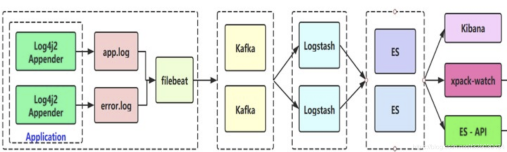
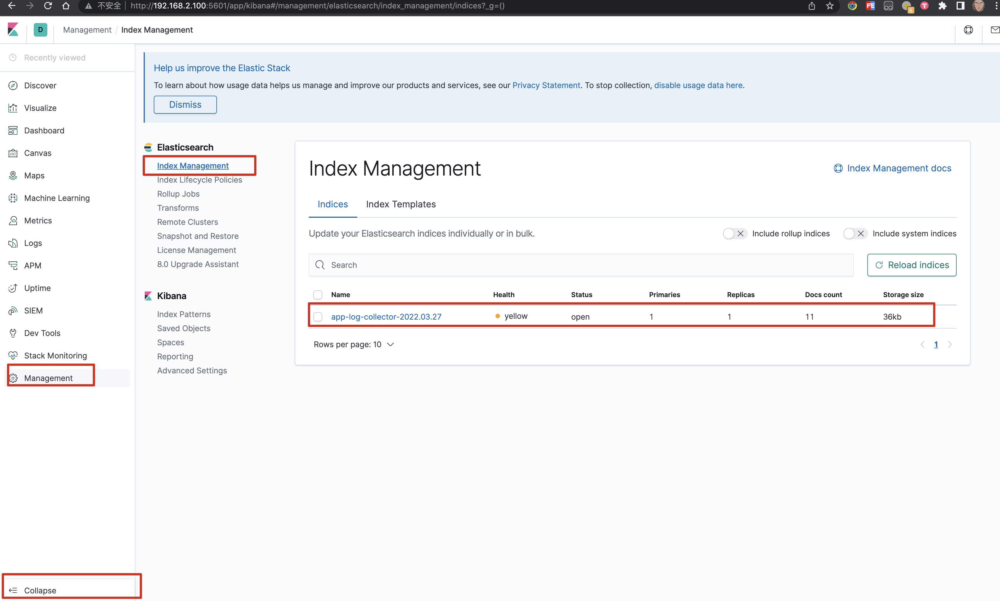
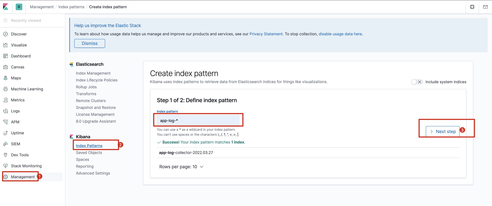
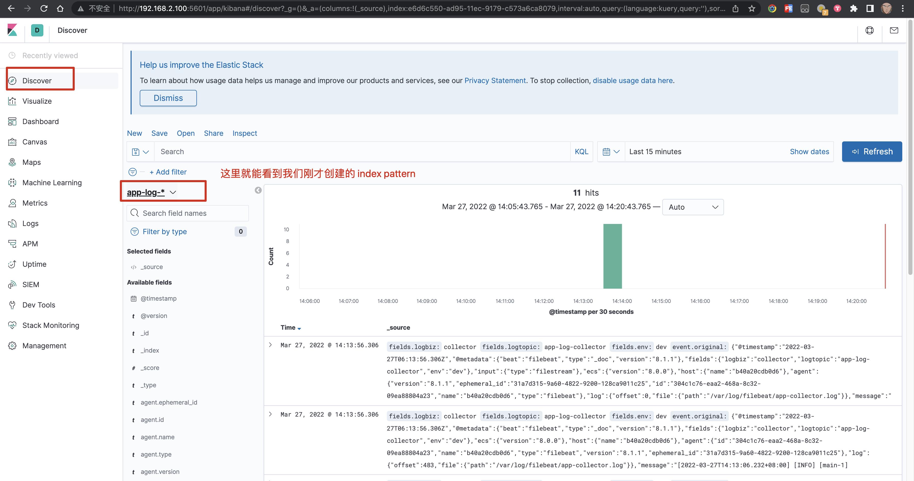

## 概述

原文：https://mp.weixin.qq.com/s/oGWffWsDRy54zj2qSUTzJg



流程：

1. filebeat 读取日志文件，封装消息发送到kafka
2. Logstash 消费 kafka的消息，输出到 ElasticSearch
3. 通过 Kibana 访问 ElasticSearch 的数据

[Filebeat](https://www.elastic.co/guide/en/beats/filebeat/current/index.html)：Filebeat
作为代理安装在您的服务器上，会监控您指定的日志文件或位置，收集日志事件,并转发到其他地方(比如：kafka、es等等)

[Logstash](https://www.elastic.co/guide/en/logstash/current/index.html): Logstash
是免费且开放的服务器端数据处理管道，能够从多个来源采集数据，转换数据，然后将数据发送到您最喜欢的“存储库”中

[ElasticSearch](https://www.elastic.co/guide/en/elasticsearch/reference/current/index.html):存储、检索、分析

[Kibana](https://www.elastic.co/guide/en/kibana/current/index.html): Kibana 使您能够调整数据形状并浏览 Elastic Stack

## 通过kibana 查看日志

查看是否生成了 index 信息



创建 index pattern





## filebeat 出错记录

配置输入：https://www.elastic.co/guide/en/beats/filebeat/current/configuration-filebeat-options.html

配置输出：https://www.elastic.co/guide/en/beats/filebeat/current/configuring-output.html

查看文件监听情况，主要是看 offset `${filebeat.registry.path}/filebeat/data.json`

**遇到的问题：**

1. filebeat监听不到文件变动

   filebeat.yml

   ```yaml
   # 一开始的配置文件
   # 因为新版本中 input_type: log 已经过时了 https://www.elastic.co/guide/en/beats/filebeat/current/filebeat-input-log.html#filebeat-input-log
   filebeat.inputs:
   - input_type: log
     enabled: true
     paths:
       - /logs/app-collector.log
       
   # 正确的配置文件
   filebeat.inputs:
   - type: filestream
     enabled: true
     paths:
       - /logs/app-collector.log
   ```


2. filebeat 鉴定到文件变动，但是不能向kafka生产消息

   ```yaml
   # 一开始的配置
   # 1. hosts 不能写ip，应该写域名
   # 2. kafka 版本是有要求的 https://www.elastic.co/guide/en/beats/filebeat/current/kafka-output.html#_version_3
   output.kafka:
     # initial brokers for reading cluster metadata
     hosts: ["192.168.2.100:9092"]
   
   # 正确的配置
   output.kafka:
     # initial brokers for reading cluster metadata
     hosts: ["kafka:9092"]
     version: 1.1.0
     # message topic selection + partitioning
     topic: '%{[fields.logtopic]}'
   ```