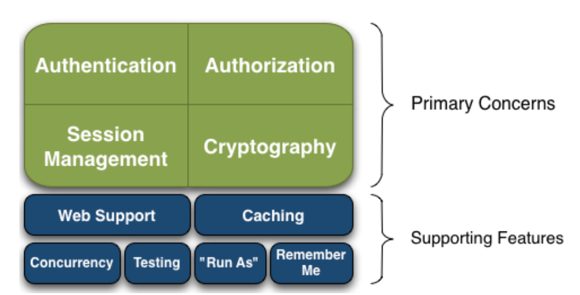
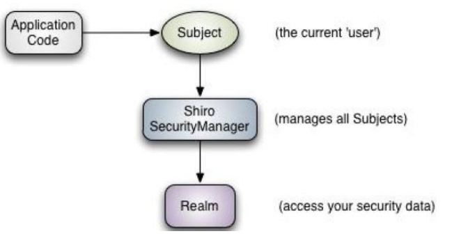
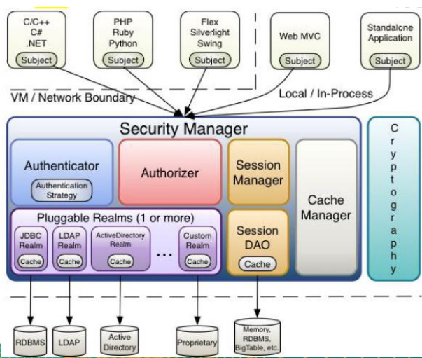
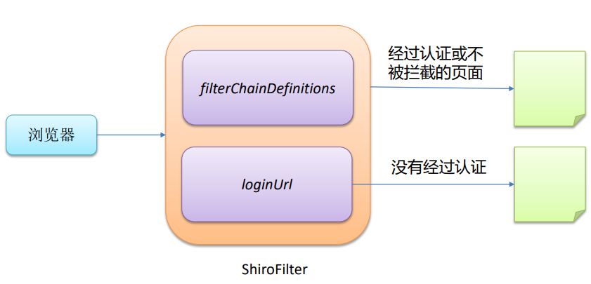
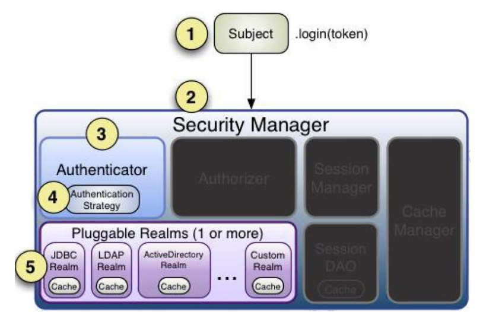
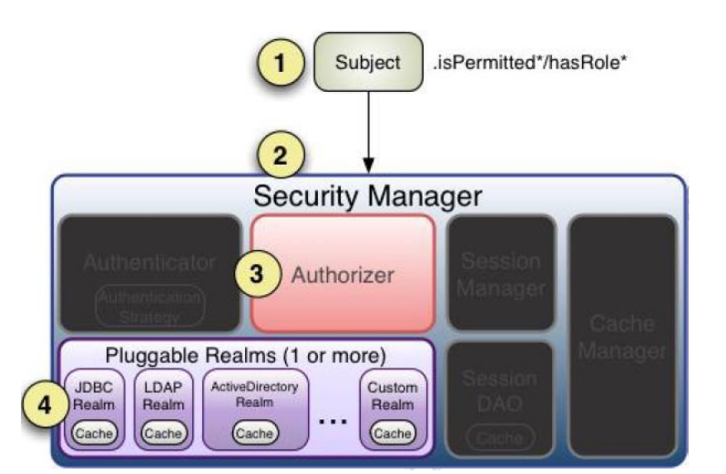
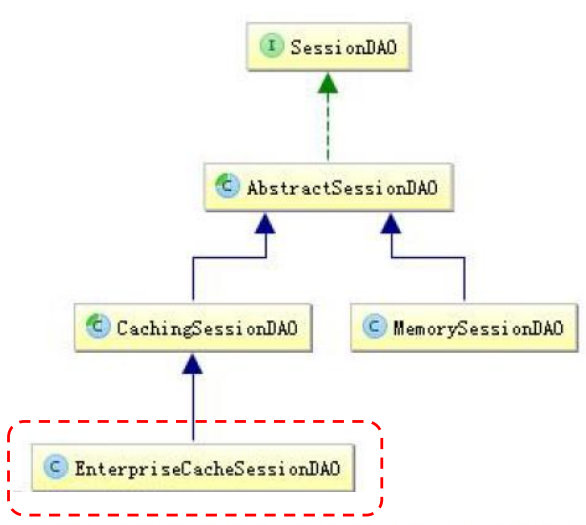

# 简介

- [Apache Shiro](http://shiro.apache.org/) 是 **Java 的一个安全（权限）框架**。
- Shiro 可以非常容易的开发出足够好的应用，其不仅可以用在 **JavaSE** 环境，也可以用在 **JavaEE** 环境。
- Shiro 可以完成：认证、授权、加密、会话管理、与Web 集成、缓存 等。

## 功能简介



- **Authentication**：身份认证/登录，验证用户是不是拥有相应的身份；
- **Authorization**：授权，即权限验证，验证某个已认证的用户是否拥有某个权限；即判断用 户是否能进行什么操作，如：验证某个用户是否拥有某个角色。或者细粒度的验证某个用户 对某个资源是否具有某个权限；
- **Session Manager**：会话管理，即用户登录后就是一次会话，在没有退出之前，它的所有 信息都在会话中；会话可以是普通 JavaSE 环境，也可以是 Web 环境的；
- Cryptography：加密，保护数据的安全性，如密码加密存储到数据库，而不是明文存储；
- Web Support：Web 支持，可以非常容易的集成到Web 环境；
- Caching：缓存，比如用户登录后，其用户信息、拥有的角色/权限不必每次去查，这样可 以提高效率；
- Concurrency：Shiro 支持多线程应用的并发验证，即如在一个线程中开启另一个线程，能把权限自动传播过去；
- Testing：提供测试支持；
- Run As：允许一个用户假装为另一个用户（如果他们允许）的身份进行访问；
- **Remember Me**：记住我，这个是非常常见的功能，即一次登录后，下次再来的话不用登 录了

## Shiro 架构

从外部来看Shiro ，即从应用程序角度的来观察如何使用 Shiro 完成 工作：



- Subject：应用代码直接交互的对象是 Subject，也就是说 Shiro 的对外 API 核心就是 Subject。Subject 代表了当前“用户”， 这个用户不一定 是一个具体的人，与当前应用交互的任何东西都是
  Subject，如网络爬虫， 机器人等；与 Subject 的所有交互都会委托给 SecurityManager； Subject 其实是一个门面，SecurityManager 才是实际的执行者；
- SecurityManager：安全管理器；即所有与安全有关的操作都会与 SecurityManager 交互；且其管理着所有 Subject；可以看出它是 Shiro 的核心，它负责与 Shiro 的其他组件进行交互，它相当于
  SpringMVC 中 DispatcherServlet 的角色
- Realm：Shiro **从 Realm 获取安全数据（如用户、角色、权限**），就是说 SecurityManager 要验证用户身份，那么它需要从 Realm 获取相应的用户 进行比较以确定用户身份是否合法；也需要从 Realm
  得到用户相应的角色/ 权限进行验证用户是否能进行操作；可以把 Realm 看成 DataSource

Shiro内部来看：



- Subject：任何可以与应用交互的“用户”；
- SecurityManager ：相当于SpringMVC 中的 DispatcherServlet；是 Shiro 的心脏； 所有具体的交互都通过 SecurityManager 进行控制；它管理着所有 Subject、且负责进
  行认证、授权、会话及缓存的管理。
- **Authenticator**：负责 Subject 认证，是一个扩展点，可以自定义实现；可以使用认证 策略（Authentication Strategy），即什么情况下算用户认证通过了；
- **Authorizer**：授权器、即访问控制器，用来决定主体是否有权限进行相应的操作；即控 制着用户能访问应用中的哪些功能；
- Realm：可以有 1 个或多个 Realm，可以认为是安全实体数据源，即用于获取安全实体 的；可以是JDBC 实现，也可以是内存实现等等；由用户提供；所以一般在应用中都需要 实现自己的 Realm；
- SessionManager：管理 Session 生命周期的组件；而 Shiro 并不仅仅可以用在 Web 环境，也可以用在如普通的 JavaSE 环境
- CacheManager：缓存控制器，来管理如用户、角色、权限等的缓存的；因为这些数据 基本上很少改变，放到缓存中后可以提高访问的性能
- Cryptography：密码模块，Shiro 提高了一些常见的加密组件用于如密码加密/解密。

# Web 集成 Shiro

- Shiro 提供了与 Web 集成的支持，其通过一个 **ShiroFilter** 入口来拦截需要安全控制的URL，然后 进行相应的控制
- ShiroFilter 类似于如 Strut2/SpringMVC 这种 web 框架的前端控制器，是安全控制的入口点，其负责读取配置（如ini 配置文件），然后判断URL 是否需要登录/权限等工作。

ShiroFilter 的工作原理



web.xml

```xml
<!--
    1. 配置  Shiro 的 shiroFilter.
    2. DelegatingFilterProxy 实际上是 Filter 的一个代理对象. 默认情况下, Spring 会到 IOC 容器中查找和
    <filter-name> 对应的 filter bean. 也可以通过 targetBeanName 的初始化参数来配置 filter bean 的 id.
    -->
<filter>
    <filter-name>shiroFilter</filter-name>
    <filter-class>org.springframework.web.filter.DelegatingFilterProxy</filter-class>
    <init-param>
        <param-name>targetFilterLifecycle</param-name>
        <param-value>true</param-value>
    </init-param>
</filter>
```

applicationContext.xml

```xml
<!--  
    配置 SecurityManager!
-->
<bean id="securityManager" class="org.apache.shiro.web.mgt.DefaultWebSecurityManager">
    <property name="cacheManager" ref="cacheManager"/>
    <property name="authenticator" ref="authenticator"></property>

    <property name="realms">
        <list>
            <ref bean="jdbcRealm"/>
            <ref bean="secondRealm"/>
        </list>
    </property>
    <property name="rememberMeManager" ref="rememberMeManager"/>

    <property name="rememberMeManager.cookie.maxAge" value="10"></property>

    <property name="sessionManager" ref="sessionManager"></property>
</bean>
```

# Shiro 中默认的过滤器

Shiro内置了很多默认的拦截器，比如身份验证、授权等相关的。默认拦截器可以参考`org.apache.shiro.web.filter.mgt.DefaultFilter`中的枚举拦截器：

| 默认拦截器名       | 拦截器类                                                     | 说明（括号里的表示默认值）                                   |
| ------------------ | ------------------------------------------------------------ | ------------------------------------------------------------ |
| **
身份验证相关的** |                                                              |                                                              |
| authc              | org.apache.shiro.web.filter.authc.FormAuthenticationFilter   | 基于表单的拦截器；如“/**=authc”，如果没有登录会跳到相应的登录页面登录；主要属性：usernameParam：表单提交的用户名参数名（ username）； passwordParam：表单提交的密码参数名（password）； rememberMeParam：表单提交的密码参数名（rememberMe）； loginUrl：登录页面地址（/login.jsp）；successUrl：登录成功后的默认重定向地址； failureKeyAttribute：登录失败后错误信息存储key（shiroLoginFailure）； |
| authcBasic         | org.apache.shiro.web.filter.authc.BasicHttpAuthenticationFilter | Basic HTTP身份验证拦截器，主要属性： applicationName：弹出登录框显示的信息（application）； |
| logout             | org.apache.shiro.web.filter.authc.LogoutFilter               | 退出拦截器，主要属性：redirectUrl：退出成功后重定向的地址（/）;示例“/logout=logout” |
| user               | org.apache.shiro.web.filter.authc.UserFilter                 | 用户拦截器，用户已经身份验证/记住我登录的都可；示例“/**=user” |
| anon               | org.apache.shiro.web.filter.authc.AnonymousFilter            | 匿名拦截器，即不需要登录即可访问；一般用于静态资源过滤；示例“/static/**=anon” |
| **
授权相关的**     |                                                              |                                                              |
| roles              | org.apache.shiro.web.filter.authz.RolesAuthorizationFilter   | 角色授权拦截器，验证用户是否拥有所有角色；主要属性： loginUrl：登录页面地址（/login.jsp）；unauthorizedUrl：未授权后重定向的地址；示例“/admin/**=roles[admin]” |
| perms              | org.apache.shiro.web.filter.authz.PermissionsAuthorizationFilter | 权限授权拦截器，验证用户是否拥有所有权限；属性和roles一样；示例“/user/**=perms["user:create"]” |
| port               | org.apache.shiro.web.filter.authz.PortFilter                 | 端口拦截器，主要属性：port（80）：可以通过的端口；示例“/test= port[80]”，如果用户访问该页面是非80，将自动将请求端口改为80并重定向到该80端口，其他路径/参数等都一样 |
| rest               | org.apache.shiro.web.filter.authz.HttpMethodPermissionFilter | rest风格拦截器，自动根据请求方法构建权限字符串（GET=read, POST=create,PUT=update,DELETE=delete,HEAD=read,TRACE=read,OPTIONS=read, MKCOL=create）构建权限字符串；示例“/users=rest[user]”，会自动拼出“user:read,user:create,user:update,user:delete”权限字符串进行权限匹配（所有都得匹配，isPermittedAll）； |
| ssl                | org.apache.shiro.web.filter.authz.SslFilter                  | SSL拦截器，只有请求协议是https才能通过；否则自动跳转会https端口（443）；其他和port拦截器一样； |
| **
其他**           |                                                              |                                                              |
| noSessionCreation  | org.apache.shiro.web.filter.session.NoSessionCreationFilter  | 不创建会话拦截器，调用 subject.getSession(false)不会有什么问题，但是如果 subject.getSession(true)将抛出 DisabledSessionException异常； |

> url 模式使用 Ant 风格模式
>
> Ant 路径通配符支持 ?、 * 、 **，注意通配符匹配不 包括目录分隔符 "/"：
>
> - `?`：匹配一个字符，如 /admin? 将匹配 /admin1，但不 匹配 /admin 或 /admin/；
> - `*`：匹配零个或多个字符串，如 /admin 将匹配 /admin、 /admin123，但不匹配 /admin/1；
> - `**`：匹配路径中的零个或多个路径，如 /admin/** 将匹 配 /admin/a 或 /admin/a/b

# 认证

## Shiro 身份认证

- 身份验证：一般需要提供如身份 ID 等一些标识信息来表明登录者的身 份，如提供 email，用户名/密码来证明。
- 在 shiro 中，用户需要提供 **principals （身份）和 credentials（证 明）**给 shiro，从而应用能验证用户身份：
- principals：身份，即主体的标识属性，可以是任何属性，如用户名、 邮箱等，唯一即可。一个主体可以有多个 principals，但只有一个 Primary principals，一般是用户名/邮箱/手机号。
- credentials：证明/凭证，即只有主体知道的安全值，如密码/数字证 书等。
- 最常见的 principals 和 credentials 组合就是用户名/密码了

## 身份验证流程

1. 收集用户身份/凭证，即如用户名/密码
2. 调用 `Subject.login` 进行登录，如果失败将得到相应的 AuthenticationException 异常，根据异常提示用户 错误信息；否则登录成功
3. 创建自定义的 **Realm** 类，继承org.apache.shiro.realm.AuthorizingRealm 类，实现 doGetAuthenticationInfo() 方法

```java
// 1. 构造用户登录信息
UsernamePasswordToken token = new UsernamePasswordToken(username, password);

// 2. 执行登录
SecurityUtils.getSubject().login(token);
	SecurityManager.login
        Authenticator.authenticate
			Realm.getAuthenticationInfo
// 所以 判断用户是否能否登录，就看 Realm.getAuthenticationInfo 方法执行
```



身份认证流程：

1. 首先调用 Subject.login(token) 进行登录，其会自动委托给 SecurityManager
2. SecurityManager 负责真正的身份验证逻辑；它会委托给 Authenticator 进行身份验证；
3. Authenticator 才是真正的身份验证者，Shiro API 中核心的身份 认证入口点，此处可以自定义插入自己的实现；
4. Authenticator 可能会委托给相应的 AuthenticationStrategy 进 行多 Realm 身份验证，默认 ModularRealmAuthenticator 会调用
   AuthenticationStrategy 进行多 Realm 身份验证；
5. Authenticator 会把相应的 token 传入 Realm，从 Realm 获取 身份验证信息，如果没有返回/抛出异常表示身份验证失败了。此处 可以配置多个Realm，将按照相应的顺序及策略进行访问。

## Realm

- Realm 是一个接口，Shiro 用户认证就是通过这个接口实现的
- Shiro 从 Realm 获取安全数据（如用户、角色、 权限），即 SecurityManager 要验证用户身份，那么它需 要从 Realm 获取相应的用户进行比较以确定用户身份是否
  合法；也需要从Realm得到用户相应的角色/权限进行验证 用户是否能进行操作
- 一般继承 **AuthorizingRealm**（授权）即可；其继承了 AuthenticatingRealm（即身份验证），而且也间接继承了 CachingRealm（带有缓存实现）。

接口定义如下：

```java
public interface Realm {
    String getName();

    // 适配哪一种 AuthenticationToken
    boolean supports(AuthenticationToken var1);

    // 编写认证逻辑
    AuthenticationInfo getAuthenticationInfo(AuthenticationToken var1) throws AuthenticationException;
}

```

## Authenticator

- Authenticator 的职责是验证用户帐号，是 Shiro API 中身份验 证核心的入口点：如果验证成功，将返回AuthenticationInfo 验 证信息；此信息中包含了身份及凭证；如果验证失败将抛出相应 的
  AuthenticationException 异常
- SecurityManager 接口继承了 Authenticator，另外还有一个 ModularRealmAuthenticator实现，其委托给多个Realm 进行 验证，验证规则通过 **
  AuthenticationStrategy** 接口指定

## AuthenticationStrategy

AuthenticationStrategy 接口的默认实现：

- FirstSuccessfulStrategy：只要有一个 Realm 验证成功即可，只返回第 一个 Realm 身份验证成功的认证信息，其他的忽略；
- AtLeastOneSuccessfulStrategy：只要有一个Realm验证成功即可，和 FirstSuccessfulStrategy 不同，将返回所有Realm身份验证成功的认证信 息；
- AllSuccessfulStrategy：所有Realm验证成功才算成功，且返回所有 Realm身份验证成功的认证信息，如果有一个失败就失败了。

ModularRealmAuthenticator **默认是 AtLeastOneSuccessfulStrategy 策略**

# 授权

- 授权，也叫**访问控制，即在应用中控制谁访问哪些资源**（如访问页面/编辑数据/页面操作 等）。在授权中需了解的几个关键对象：主体（Subject）、资源（Resource）、权限 （Permission）、角色（Role）。
- 主体(Subject)：访问应用的用户，在 Shiro 中使用 **Subject** 代表该用户。用户只有授权 后才允许访问相应的资源。
- 资源(Resource)：**在应用中用户可以访问的 URL**，比如访问 JSP 页面、查看/编辑某些 数据、访问某个业务方法、打印文本等等都是资源。用户只要授权后才能访问。
- 权限(Permission)：安全策略中的原子授权单位，通过权限我们可以表示在应用中用户 有没有操作某个资源的权力。即**权限表示在应用中用户能不能访问某个资源**，如：访问用
  户列表页面查看/新增/修改/删除用户数据（即很多时候都是CRUD（增查改删）式权限控 制）等。权限代表了用户有没有操作某个资源的权利，即反映在某个资源上的操作允不允 许。
- Shiro 支持粗粒度权限（如用户模块的所有权限）和细粒度权限（操作某个用户的权限， 即实例级别的）
- 角色(Role)：**权限的集合**，一般情况下会赋予用户角色而不是权限，即这样用户可以拥有 一组权限，赋予权限时比较方便。典型的如：项目经理、技术总监、CTO、开发工程师等 都是角色，不同的角色拥有一组不同的权限。

## Shiro 支持的授权方式

Shiro 支持三种方式的授权:

- **编程式**：通过写if/else 授权代码块完成
- **注解式**：通过在执行的Java方法上放置相应的注解完成，没有权限将抛出相 应的异常
- JSP/GSP 标签：在JSP/GSP 页面通过相应的标签完成

```java
if (SecurityUtils.getSubject().hasRole("schwartz")) {
    log.info("----> May the Schwartz be with you!");
}
```

```java
@RequiresRoles({"admin"})
public void testMethod() {}
```

```xml
<shiro:hasRole name="user">
    <br><br>
    <a href="user.jsp">User Page</a>
</shiro:hasRole>
```

## Shiro 中 的 Permissions

规则：`资源标识符:操作:对象实例ID` (即对哪个资源（领域）的哪个实例可以进行什么操作)

其默认支持通配符权限字符串

- `:` 表示资源/操作/实例的分割
- `,` 表示操作的分割，
- `*` 表示任意资源/操作/实例。

多层次管理示例：

| permission 表达式 | 权限含义                      |
| ----------------- | ----------------------------- |
| user:query        | user领域中 query 操作         |
| user:query, edit  | user领域中 query 和 edit 操作 |
| user:*            | user领域中 任何操作           |
| *:query           | 任何领域中 query操作          |

实例级访问控制：

这种情况通常会使用三个部件：域、操作、被付诸实施的实例。如：user:edit:manager

| permission 表达式                | 权限含义                           |
| -------------------------------- | ---------------------------------- |
| `user:edit:manager`              | user域中manager实例 具有 edit 操作 |
| `user:edit` 等价于 `user:edit:*` | user域中所有实例都具有 edit操作    |
| `user` 等价于 `user:*:*`         | user域中所有实例都具有 所有操作    |

## 授权流程



流程如下：

1. 首先调用 Subject.isPermitted*/hasRole* 接口，其会委托给 SecurityManager，而 SecurityManager 接着会委托给 Authorizer；
2. Authorizer是真正的授权者，如果调用如 isPermitted(“user:view”)，其首先会通过 PermissionResolver 把字符串转换成相应的 Permission 实例；
3. 在进行授权之前，其会调用相应的 Realm 获取 Subject 相应的角色/权限用于匹配传入的角色/权限；
4. Authorizer 会判断 Realm 的角色/权限是否和传入的匹配，如果 有多个Realm，会委托给 ModularRealmAuthorizer 进行循环判断， 如果匹配如 isPermitted*/hasRole*
   会返回true，否则返回false表示 授权失败。

## ModularRealmAuthorizer

ModularRealmAuthorizer 进行多 Realm 匹配流程：

1. 首先检查相应的 Realm 是否实现了实现了Authorizer；
2. 如果实现了 Authorizer，那么接着调用其相应的 isPermitted*/hasRole* 接口进行匹配；
3. 如果有一个Realm 匹配那么将返回 true，否则返回 false。

## Shiro 标签

- Shiro 提供了 JSTL 标签用于在 JSP 页面进行权限控制，如 根据登录用户显示相应的页面按钮。

- guest 标签：用户没有身份验证时显示相应信息，即游客 访问信息

  ```xml
  <shiro:guest>
      欢迎游客访问，<a href="login.jsp">登录</a>
  </shiro:guest>
  ```

- user 标签：用户已经经过认证/记住我登录后显示相应的信 息

  ```xml
  <shiro:user>
      欢迎【<shiro:principal/>】登录，<a href="logout">退出</a>
  </shiro:user>
  ```

- authenticated 标签：用户已经身份验证通过，即 Subject.login登录成功，**不是记住我登录的**

  ```xml
  <shiro:authenticated>
      用户【<shiro:principal/>】已身份验证通过
  </shiro:authenticated>
  ```

- notAuthenticated 标签：用户未进行身份验证，即没有调 用Subject.login进行登录，**包括记住我自动登录的**也属于 未进行身份验证。

  ```xml
  <shiro:notAuthenticated>
      未身份验证（包括记住我）
  </shiro:notAuthenticated>
  ```

- pincipal 标签：**显示用户身份信息**，默认调用 Subject.getPrincipal() 获取，即 Primary Principal。

  ```xml
  <shiro:principal property="username"/>
  ```

- hasRole 标签：如果当前 Subject 有角色将显示 body 体内 容：

  ```xml
  <shiro:hasRole name="admin">
      用户【<shiro:principal/>】 拥有角色 admin
  </shiro:hasRole>
  ```

- hasAnyRoles 标签：如果当前Subject有任意一个 角色（或的关系）将显示body体内容。

  ```xml
  <shiro:hasAnyRoles name="admin,user">
      用户【<shiro:principal/>】 拥有角色 admin 或 user
  </shiro:hasAnyRoles>
  ```

- lacksRole：如果当前 Subject 没有角色将显 示 body 体内容

  ```xml
  <shiro:lacksRole name="admin">
      用户【<shiro:principal/>】 没有角色 admin
  </shiro:lacksRole>
  ```

- hasPermission：如果当前 Subject 有权限 将显示 body 体内容

  ```xml
  <shiro:hasPermission name="user:create">
      用户【<shiro:principal/>】拥有权限 user:create
  </shiro:hasPermission>
  ```

- lacksPermission：如果当前Subject没有权 限将显示body体内容。

  ```xml
  <shiro:lacksPermission name="org:create">
      用户【<shiro:principal/>】没有权限 org:create
  </shiro:lacksPermission>
  ```

## 权限注解

- @RequiresAuthentication：表示当前Subject已经通过login 进行了身份验证；即 Subject. isAuthenticated() 返回 true
- @RequiresUser：表示当前 Subject 已经**身份验证或者通过记住我登录的**。
- @RequiresGuest：表示当前Subject没有身份验证或通过记住 我登录过，即是**游客身份**。
- @RequiresRoles(value={“admin”, “user”}, logical= Logical.AND)：表示当前 Subject **需要角色** admin 和user
- @RequiresPermissions (value={“user:a”, “user:b”}, logical= Logical.OR)：表示当前 Subject **需要权限** user:a 或 user:b。

# 会话管理

Shiro 提供了完整的企业级会话管理功能，**不依赖于底层容器**（如web容器tomcat），**不管 JavaSE 还是 JavaEE 环境 都可以使用**，提供了会话管理、会话事件监听、会话存储/
持久化、容器无关的集群、失效/过期支持、对Web 的透明 支持、SSO 单点登录的支持等特性。

## 会话相关的 API

- `Subject.getSession()`：即可获取会话；其等价于 Subject.getSession(true)`，即如果当前没有创建 Session 对象会创建 一个；Subject.getSession(false)
  ，如果当前没有创建 Session 则返回 null
- `session.getId()`：获取当前会话的唯一标识
- `session.getHost()`：获取当前Subject的主机地址
- `session.getTimeout() & session.setTimeout(毫秒)`：获取/设置当 前Session的过期时间
- `session.getStartTimestamp() & session.getLastAccessTime()`： 获取会话的启动时间及最后访问时间；如果是 JavaSE 应用需要自己定 期调用 session.touch()
  去更新最后访问时间；如果是 Web 应用，每 次进入 ShiroFilter 都会自动调用 session.touch() 来更新最后访问时间。
- `session.touch() & session.stop()`：更新会话最后访问时 间及销毁会话；当Subject.logout()时会自动调用 stop 方法 来销毁会话。如果在web中，调用 HttpSession.
  invalidate() 也会自动调用Shiro Session.stop 方法进行销毁Shiro 的会 话
- `session.setAttribute(key, val) & session.getAttribute(key) & session.removeAttribute(key)`：设置/获取/删除会话属
  性；在整个会话范围内都可以对这些属性进行操作

## 会话监听器

会话监听器用于监听会话创建、过期及停止事件

```java
package org.apache.shiro.session;

public interface SessionListener {
    void onStart(Session session);
    void onStop(Session session);
    void onExpiration(Session session);
}

```

## SessionDao



- AbstractSessionDAO 提供了 SessionDAO 的**基础实现**， 如生成会话ID等
- CachingSessionDAO 提供了对开发者透明的**会话缓存的功能**，需要设置相应的 CacheManager
- MemorySessionDAO 直接在**内存中进行会话维护**
- EnterpriseCacheSessionDAO 提供了缓存功能的会话维 护，默认情况下使用 MapCache 实现，内部使用 ConcurrentHashMap 保存缓存的会话。

applicationContext.xml

```xml
<bean id="securityManager" class="org.apache.shiro.web.mgt.DefaultWebSecurityManager">
    <property name="cacheManager" ref="cacheManager"/>
    <property name="sessionManager" ref="sessionManager"></property>
</bean>
<bean id="cacheManager" class="org.apache.shiro.cache.ehcache.EhCacheManager">
    <property name="cacheManagerConfigFile" value="classpath:ehcache.xml"/>
</bean>
<!-- Session ID 生成器-->
<bean id="sessionIdGenerator"
      class="org.apache.shiro.session.mgt.eis.JavaUuidSessionIdGenerator"/>

<!-- Session DAO. 继承 EnterpriseCacheSessionDAO -->
<bean id="sessionDAO"
      class="com.atguigu.shiro.realms.MySessionDao">
    <property name="activeSessionsCacheName" value="shiro-activeSessionCache"/>
    <property name="sessionIdGenerator" ref="sessionIdGenerator"/>
</bean>

<!-- 会话管理器-->
<bean id="sessionManager" class="org.apache.shiro.session.mgt.DefaultSessionManager">
    <property name="globalSessionTimeout" value="1800000"/>
    <property name="deleteInvalidSessions" value="true"/>
    <property name="sessionValidationSchedulerEnabled" value="true"/>
    <property name="sessionDAO" ref="sessionDAO"/>
</bean>

```

ehcache.xml

```xml
<cache name="shiro-activeSessionCache"
           eternal="false"
           timeToIdleSeconds="3600"
           timeToLiveSeconds="0"
           overflowToDisk="false"
           statistics="true">
    </cache>
```

db.sql

```sql
create table sessions (
 id varchar(200),
 session varchar(2000),
 constraint pk_sessions primary key(id)
 ) charset=utf8 ENGINE=InnoDB;
```

## 会话验证

- Shiro 提供了**会话验证调度器**，**用于定期的验证会话是否已过期**，如果过期将停止会话
- 出于性能考虑，一般情况下都是获取会话时来验证会话是 否过期并停止会话的；但是如在 web 环境中，如果用户不 主动退出是不知道会话是否过期的，因此需要定期的检测 会话是否过期，Shiro 提供了会话验证调度器 **
  SessionValidationScheduler**
- Shiro 也提供了使用Quartz会话验证调度器： **QuartzSessionValidationScheduler**

# 缓存

## CacheManagerAware 接口

Shiro 内部相应的组件（DefaultSecurityManager）会自动检测相应的对象（如DefaultWebSecurityManager）**是否实现了 CacheManagerAware 并自动注入相应的
CacheManager**。

## Realm 缓存

- Shiro 提供了 CachingRealm，其实现了 CacheManagerAware 接口，提供了缓存的一些基础实现；
- AuthenticatingRealm 及 AuthorizingRealm 也分别提供了对AuthenticationInfo 和 AuthorizationInfo 信息的缓存。

## Session 缓存

- 如 SecurityManager 实现了 SessionSecurityManager， 其会判断 SessionManager 是否实现了 CacheManagerAware 接口，如果实现了会把 CacheManager
  设置给它。
- SessionManager 也会判断相应的 SessionDAO（如继承 自CachingSessionDAO）是否实现了 CacheManagerAware，如果实现了会把 CacheManager 设置给它
- 设置了缓存的 SessionManager，查询时会先查缓存，如 果找不到才查数据库。

# RememberMe

Shiro 提供了记住我（RememberMe）的功能，比如访问如淘宝 等一些网站时，关闭了浏览器，下次再打开时还是能记住你是谁， 下次访问时无需再登录即可访问，基本流程如下：

1. 首先在登录页面选中 RememberMe 然后登录成功；如果是 浏览器登录，一般会把 **RememberMe 的Cookie 写到客户端并 保存下来**；
2. 关闭浏览器再重新打开；会发现浏览器还是记住你的；
3. 访问一般的网页服务器端还是知道你是谁，且能正常访问；
4. 但是比如我们访问淘宝时，如果要查看我的订单或进行支付 时，此时还是需要再进行身份认证的，以确保当前用户还是你。

## 认证和记住我

- subject.isAuthenticated() 表示用户进行了**身份验证登录**的， 即使有 Subject.login 进行了登录；
- subject.isRemembered()：表示用户是**通过记住我**登录的， 此时可能并不是真正的你（如你的朋友使用你的电脑，或者 你的cookie 被窃取）在访问的
- 两者二选一，即 subject.isAuthenticated()==true，则 subject.isRemembered()==false；反之一样。

## 建议

- **访问一般网页**：如个人在主页之类的，我们使用user 拦截 器即可，user 拦截器只要用户登录` (isRemembered() || isAuthenticated())`过即可访问成功
- **访问特殊网页**：如我的订单，提交订单页面，我们使用 authc 拦截器即可，authc 拦截器会判断用户是否是通过 Subject.login（`isAuthenticated()==true`）登录的，如
  果是才放行，否则会跳转到登录页面叫你重新登录。

## 实现 RememberMe

```java
UsernamePasswordToken token = new UsernamePasswordToken(username, password);
// rememberme
token.setRememberMe(true);

// 登录
currentUser.login(token);
```

applicationContext.xml

```xml
<bean id="securityManager" class="org.apache.shiro.web.mgt.DefaultWebSecurityManager">
    <property name="rememberMeManager" ref="rememberMeManager"/>
    <property name="rememberMeManager.cookie.maxAge" value="10"></property>
</bean> 

<bean id="rememberMeCookie" class="org.apache.shiro.web.servlet.SimpleCookie">
    <constructor-arg value="rememberMe"/>
    <property name="httpOnly" value="true"/>
    <property name="maxAge" value="2592000"/><!-- 30天-->
</bean>

<!-- rememberMe管理器-->
<bean id="rememberMeManager"
      class="org.apache.shiro.web.mgt.CookieRememberMeManager">
    <property name="cipherKey" value="
                                      #{T(org.apache.shiro.codec.Base64).decode('4AvVhmFLUs0KTA3Kprsdag==')}"/>
    <property name="cookie" ref="rememberMeCookie"/>
</bean>
```